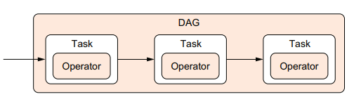

# Introdución a Apache Airflow

Apache Airflow é unha ferramenta de orquestración de fluxos de traballo. A súa función principal non é facer o procesado pesado dos datos, senón coordinar cando se executa cada paso, en que orde debe facelo, que dependencias existen entre tarefas e cal foi o resultado de cada execución.

Nun pipeline de datos isto é especialmente útil, porque moitos procesos non consisten nunha única acción illada, senón nunha secuencia de pasos encadeados. Por exemplo, un fluxo real pode incluír a lectura dun ficheiro, a súa limpeza, unha transformación intermedia, unha carga nun sistema de destino e unha comprobación final. Airflow permite describir ese fluxo como unha estrutura organizada e executalo de maneira controlada.

O libro que estamos usando como referencia insiste nunha idea moi útil para empezar: un pipeline pode pensarse como un grafo de tarefas con dependencias, e non só como un script longo que fai cousas unha detrás doutra. Esa diferenza é importante porque cambia a forma de deseñar, executar e manter os procesos.

*Exemplo dun pipeline representado como un DAG, con varias tarefas e cunha rama que pode executarse en paralelo. Adaptado da figura 2.5 do libro* Data Pipelines with Apache Airflow*.*

## Por que é importante Airflow

Airflow resolve un problema moi habitual en contornas de datos: non abonda con ter ferramentas capaces de procesar información, tamén fai falta coordinalas. Nunha arquitectura moderna adoitan convivir varias pezas especializadas, e cada unha cumpre un papel distinto.:

- Spark procesa datos
- Kafka transporta eventos ou mensaxes
- MinIO almacena obxectos
- Airflow coordina o fluxo xeral

Isto significa que Airflow non substitúe estas ferramentas. O seu valor está en definir a orde correcta das operacións, lanzar as tarefas cando corresponde, rexistrar o que ocorreu e facilitar a supervisión do pipeline.

## Grafos de tarefas fronte a scripts secuenciais

Un dos mellores xeitos de entender Airflow é comparalo cun enfoque máis clásico: escribir un script secuencial que execute todos os pasos de principio a fin.

Nun script monolítico:

- os pasos adoitan quedar mesturados nun único bloque
- custa máis ver que tarefas son independentes
- se algo falla no medio, moitas veces hai que repetir máis do necesario

Nun fluxo modelado como DAG:

- cada tarefa aparece como unha unidade separada
- as dependencias quedan explícitas
- as ramas independentes poden executarse en paralelo
- é máis fácil relanzar só a parte que fallou

Esta maneira de representar os pipelines como grafos é unha das razóns polas que Airflow resulta especialmente axeitado para procesos de datos con varios pasos, dependencias e necesidades de seguimento.

*Comparación visual entre un script secuencial monolítico e o mesmo proceso expresado como DAG en Airflow.*

## Que permite facer

Con Airflow podemos:

- definir fluxos de traballo compostos por varias tarefas
- establecer dependencias entre esas tarefas
- programar execucións automáticas ou lanzalas manualmente
- consultar o estado de execución de cada paso
- acceder aos logs xerados polas tarefas
- repetir execucións fallidas e analizar en que punto se produciu o problema

Por iso Airflow é moi habitual en procesos ETL e ELT, automatizacións periódicas e pipelines nos que importa tanto a lóxica da execución como a trazabilidade do que sucedeu.

## Idea central: orquestrar non é procesar

A idea máis importante para empezar con Airflow é distinguir entre orquestración e execución do traballo real.

Airflow organiza o fluxo, pero o traballo concreto de cada tarefa pode ser moi diverso:

- executar código Python
- lanzar un comando de shell
- chamar unha API
- executar unha consulta SQL
- poñer en marcha un proceso externo
- desencadear un job de Spark

Isto fai que Airflow sexa unha capa de coordinación. O foco está no control do proceso, non necesariamente no cálculo nin no almacenamento.

## Cando ten sentido usar Airflow

Airflow encaixa ben cando necesitamos:

- procesos compostos por varias tarefas con dependencias claras
- execución periódica ou controlada por calendario
- trazabilidade de execucións, estados e logs
- integración con varios sistemas distintos
- capacidade para repetir execucións, recuperar fallos e manter historial

É dicir, Airflow é especialmente valioso cando o problema principal non é só executar código, senón coordinar un fluxo completo de traballo.

## Cando non é a mellor opción

Tamén convén introducir desde o principio unha idea importante que aparece no libro: Airflow non é a solución ideal para todo.

Pode non ser a mellor opción cando:

- só temos un script pequeno e lineal sen apenas dependencias
- non precisamos planificación, observabilidade nin histórico
- queremos resolver computación distribuída pesada que xa pertence a outra ferramenta
- buscamos latencias moi baixas ou resposta en tempo real estrito

Nestes casos, Airflow podería engadir máis estrutura e máis custo operativo do necesario. Isto non lle resta valor; ao contrario, axuda a entender mellor cal é o seu espazo natural.

## Conceptos básicos

Para comezar a traballar con Airflow hai varios conceptos que convén ter claros.

### DAG

`DAG` significa `Directed Acyclic Graph`. En Airflow, un DAG é a definición dun fluxo de traballo.

- `Directed` indica que hai unha dirección nas dependencias
- `Acyclic` indica que non pode haber ciclos pechados
- `Graph` indica que o fluxo se representa como unha rede de tarefas conectadas

O DAG describe que tarefas existen, en que orde se relacionan e baixo que condicións poden executarse.

### Task

Unha `task` é unha unidade individual de traballo dentro dun DAG. Nun exemplo simple pode imprimir unha mensaxe ou executar un comando; nun caso real pode mover datos, consultar unha API ou lanzar un procesado máis complexo.

### Operator

Un `operator` é o tipo de mecanismo empregado para executar unha tarefa. Por exemplo, hai operadores para executar funcións Python, comandos de shell, consultas SQL ou interaccións con servizos externos.

En termos simples:

- o operador define o tipo de execución
- a tarefa é a instancia concreta dese paso dentro do DAG

### Scheduler

O `scheduler` é o compoñente que decide cando toca lanzar un DAG e cando poden avanzar as súas tarefas segundo o calendario definido e as dependencias existentes.

### Executor

O `executor` é o compoñente encargado de executar as tarefas que o sistema decide lanzar. Segundo o tipo de despregamento, Airflow pode empregar executores distintos.

### DAG processor, workers e triggerer

O libro tamén axuda a ver Airflow como un sistema composto por varias pezas. Ademais do `scheduler` e do `executor`, hai outros compoñentes que iremos atopando con frecuencia:

- o `DAG processor`, que le os ficheiros dos DAGs e extrae a súa definición
- os `workers`, que executan as tarefas programadas
- o `triggerer`, que xestiona tarefas diferidas e comprobacións asíncronas en certos casos
- o servidor web ou API, desde o que se consulta e supervisa o sistema

Non fai falta dominalos todos desde o primeiro día, pero si convén recoñecer os nomes porque forman parte da arquitectura básica de Airflow.

*Esquema simple da arquitectura de Airflow con usuario, ficheiro DAG, DAG processor, scheduler, executor ou workers, metastore e interface web/API.*

### DAG run e task instance

Un `dag run` é unha execución concreta dun DAG. Unha `task instance` é a execución concreta dunha tarefa dentro dese `dag run`.

Esta distinción é importante porque un mesmo DAG pode executarse moitas veces, e en cada execución cada tarefa terá o seu propio estado.

## Execución manual e execución programada

Un DAG pode executarse de dúas maneiras principais:

- manualmente, cando o usuario o lanza desde a interface ou a liña de comandos
- automaticamente, seguindo un calendario definido

En contextos introdutorios adoita ser útil comezar con execución manual, porque facilita entender o comportamento do DAG sen engadir aínda a complexidade da planificación temporal.

## O papel de Airflow neste proxecto

Neste repositorio, Airflow enténdese como a capa de orquestración dentro dun stack dockerizado de datos. O obxectivo non é só usar a ferramenta, senón entender como encaixa nunha arquitectura máis ampla na que conviven varios servizos especializados.

Isto permite traballar Airflow desde unha perspectiva docente e práctica ao mesmo tempo:

- como ferramenta de definición de pipelines
- como compoñente integrado nunha plataforma de datos
- como punto de observación do estado, os logs e a execución dos fluxos

## Para seguir avanzando

A partir desta introdución, os seguintes pasos naturais son:

1. entender a estrutura dun DAG sinxelo
2. ver que servizos de Airflow participan no despregamento do proxecto
3. crear un primeiro exemplo práctico con tarefas básicas

Este documento funciona como punto de partida conceptual. Nos seguintes materiais xa podemos baixar desde a teoría xeral ata a definición e execución de DAGs concretos.
