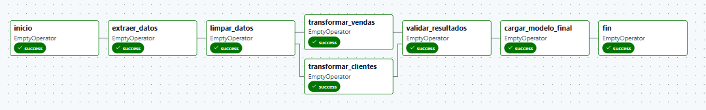
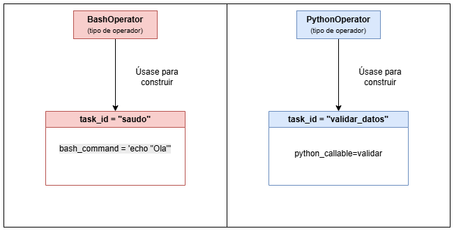
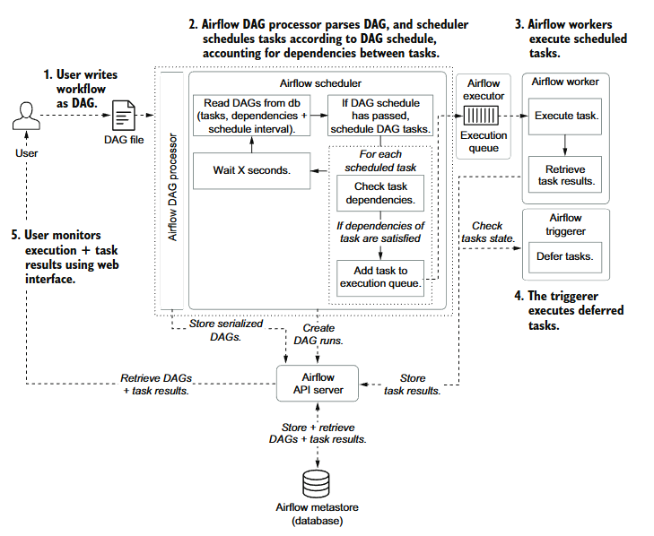
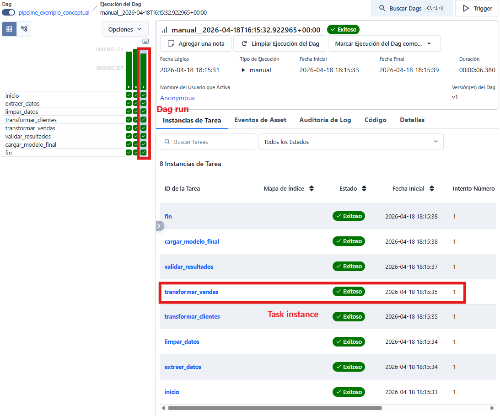

# Conceptos básicos de Airflow

Despois dunha primeira introdución xeral, o seguinte paso é aclarar a linguaxe propia de Airflow. Entender ben estes conceptos evita moitas confusións cando comezamos a ler exemplos, a escribir DAGs ou a interpretar o que aparece na interface web.

Airflow ten unha terminoloxía bastante estable e moi ligada á forma en que modela os fluxos de traballo. Neste documento imos revisar os conceptos fundamentais que aparecen de maneira constante.

## O DAG como unidade de definición

O concepto máis importante en Airflow é o `DAG`, sigla de `Directed Acyclic Graph`.

Esta expresión pode parecer técnica ao principio, pero a idea é bastante intuitiva:

- `Directed` significa que hai unha dirección entre pasos
- `Acyclic` significa que non se permiten ciclos pechados
- `Graph` significa que o fluxo se representa como un conxunto de nodos e relacións

En Airflow, un DAG é a definición dun fluxo de traballo. Non é unha execución concreta, senón o plano que describe:

- que tarefas forman parte do proceso
- en que orde deben executarse
- que dependencias existen entre elas
- con que configuración se lanzan
- cando poden executarse

Un DAG é, por tanto, unha descrición declarativa do pipeline.

O interesante deste enfoque é que o DAG fai visible a estrutura do proceso. En vez de ocultar toda a lóxica nun script secuencial, permite representar o fluxo como un conxunto de pasos conectados. Isto ten varias consecuencias prácticas:

- facilita entender que depende de que
- permite detectar tarefas independentes
- abre a porta á execución en paralelo
- fai máis doado repetir só unha parte do fluxo cando algo falla

Por iso Airflow resulta máis expresivo para pipelines complexos que un único script monolítico.

*Representación simple dun DAG como grafo de tarefas conectadas por dependencias.*

## Que é unha task

Unha `task` é a unidade mínima de traballo dentro dun DAG. Cada task representa un paso concreto do proceso.

Nun exemplo sinxelo, unha task pode:

- imprimir unha mensaxe
- executar un comando de shell
- crear ou ler un ficheiro

Nun pipeline real, tamén pode:

- lanzar un proceso de transformación
- chamar unha API
- mover datos entre sistemas
- executar unha consulta SQL
- poñer en marcha un job externo

O importante é entender que unha task debe representar un paso ben identificado dentro do fluxo.

No deseño de pipelines, isto adoita levarnos a unha recomendación útil: preferir tarefas pequenas e con responsabilidade clara fronte a tarefas enormes que fan demasiadas cousas ao mesmo tempo.

## A diferenza entre task e operator

Un dos puntos que máis se confunden ao empezar é a relación entre `task` e `operator`.

Un `operator` é o mecanismo ou tipo de execución que Airflow ofrece para construír unha tarefa. A `task`, en cambio, é a instancia concreta dese paso dentro dun DAG.

Podémolo ver así:

- o `operator` indica como se vai executar algo
- a `task` é ese algo concreto dentro do noso fluxo

Por exemplo:

- `PythonOperator` úsase para executar unha función Python
- `BashOperator` úsase para lanzar un comando de shell

Se empregamos un `BashOperator` para lanzar o comando `echo "Ola"`, o operador é `BashOperator`, mentres que a task é o paso concreto do DAG que executa esa orde.

*Exemplo visual da diferenza entre `operator` e `task`: o operator define o tipo de execución e a task é a instancia concreta dese paso dentro do DAG.*

## Dependencias entre tarefas

Un DAG non é simplemente unha lista de tarefas illadas. O realmente importante é como se relacionan entre si.

As dependencias indican que tarefas deben rematar antes de que poidan comezar outras. Isto permite expresar a lóxica do fluxo:

- unha tarefa inicial prepara datos
- outra tarefa posterior os transforma
- unha terceira carga o resultado final

Airflow usa esas dependencias para saber que pode executar e que debe esperar.

Isto é o que converte un conxunto de pasos nun fluxo coordinado.

Unha consecuencia importante é que non todas as tarefas teñen por que executarse en cadea. Se dúas ramas do DAG non dependen entre si, Airflow pode planificalas de maneira independente, e iso permite aproveitar mellor os recursos dispoñibles.

## Scheduler

O `scheduler` é un dos compoñentes centrais de Airflow. A súa responsabilidade é decidir cando toca lanzar os DAGs e cando poden avanzar as súas tarefas.

Para tomar esa decisión, ten en conta:

- a configuración temporal do DAG
- as dependencias entre tarefas
- o estado das execucións anteriores
- a dispoñibilidade das tarefas que xa poden correr

En termos simples, o scheduler interpreta o plan e vai marcando que pezas poden poñerse en marcha en cada momento.

O libro insiste en que o scheduler é unha das pezas máis centrais de Airflow, porque é onde realmente se decide como pasar da definición do DAG á súa execución efectiva.

## DAG processor, workers e triggerer

Para completar o modelo mental básico, convén introducir outros compoñentes que poden participar no ciclo de vida dun DAG:

- o `DAG processor` le os ficheiros Python dos DAGs e extrae tarefas, dependencias e configuración
- os `workers` executan as tarefas que xa foron programadas
- o `triggerer` atende certos casos de execución asíncrona ou diferida
- o servidor web ou API permite visualizar os DAGs, os estados e os resultados

Visto en conxunto, o fluxo simplificado é este:

1. escribimos un DAG nun ficheiro Python
2. o `DAG processor` interprétao e rexístrao no sistema
3. o `scheduler` decide cando lanzar un `dag run`
4. o `executor` e os `workers` executan as tarefas correspondentes
5. o usuario consulta resultados, estados e logs na interface

Ter esta película xeral na cabeza axuda moito para entender como pasa Airflow da definición dun fluxo á súa execución e supervisión.

*Fluxo simplificado do ciclo interno dun DAG en Airflow: definición no ficheiro, procesado, planificación, execución e observación desde a interface e os logs. Adaptado da imaxe 1.9 do libro.*

## Executor

O `executor` é o compoñente que se encarga de executar realmente as tarefas que o scheduler decide lanzar.

Isto significa que scheduler e executor non son exactamente o mesmo:

- o scheduler decide cando toca executar
- o executor fai efectiva esa execución

Segundo a arquitectura escollida, Airflow pode traballar con distintos executores. A idea xeral é que todos serven para lanzar tarefas, pero non todos o fan do mesmo xeito nin están pensados para o mesmo tipo de contorno.

Algúns dos executores máis habituais son os seguintes:

- `SequentialExecutor`: executa unha tarefa cada vez, de maneira secuencial. É simple, pero moi limitado.
- `LocalExecutor`: permite executar varias tarefas en paralelo no mesmo nodo ou máquina.
- `CeleryExecutor`: distribúe tarefas entre varios workers e adoita empregarse en contornas máis grandes.
- `KubernetesExecutor`: crea execucións apoiándose en Kubernetes, o que dá máis illamento e elasticidade.

Cada opción ten vantaxes e custos:

- as opcións máis simples son máis fáciles de entender e manter
- as opcións distribuídas escalan mellor, pero requiren máis compoñentes e máis configuración

Nunha introdución a Airflow, o importante non é memorizar todos os executores, senón entender a idea central: o `executor` é a peza que materializa a execución das tarefas unha vez que o scheduler decidiu que xa poden correr.

## DAG run

Un `dag run` é unha execución concreta dun DAG.

Isto é moi importante: o DAG é a definición do fluxo, pero cada vez que ese fluxo se lanza créase unha execución independente.

Por exemplo, se un DAG está programado para correr todos os días, cada día producirá un novo `dag run`. Se ademais o usuario o lanza manualmente, tamén se xerará outro.

Así, unha mesma definición pode ter moitas execucións ao longo do tempo.

*Esquema visual da diferenza entre un DAG como definición, varios `dag runs` como execucións concretas e as `task instances` correspondentes dentro de cada execución.*

## Task instance

Unha `task instance` é a execución concreta dunha tarefa dentro dun `dag run` específico.

Isto permite entender mellor como Airflow rexistra o estado:

- a task é o paso definido no DAG
- a task instance é ese paso nunha execución concreta

Por iso a mesma task pode aparecer unhas veces como exitosa, outras como fallida e outras como pendente. O estado non pertence á definición abstracta da tarefa, senón a cada execución concreta.

## Estados de execución

Airflow rexistra o estado das execucións tanto a nivel de DAG como a nivel de tarefa. Isto é unha parte esencial do seu valor como ferramenta de orquestración.

Segundo o caso, unha tarefa pode estar:

- pendente
- en execución
- completada con éxito
- fallida
- reintentándose

Esta trazabilidade permite saber non só se o pipeline funcionou, senón tamén onde se produciu un erro e en que momento.

Isto enlaza cunha vantaxe práctica do modelo en DAGs: cando o fluxo está dividido en tarefas ben separadas, o sistema pode identificar mellor en que paso fallou a execución e evitar repetir innecesariamente partes que xa remataron con éxito.

## Execución manual e execución programada

Airflow permite dúas formas principais de lanzar un fluxo:

- execución manual
- execución programada

Na execución manual, o usuario decide cando lanzar o DAG. Isto é especialmente útil en contornas de aprendizaxe, probas e depuración.

Na execución programada, o DAG segue un calendario. Nese caso, Airflow crea novas execucións segundo a planificación definida.

Ao empezar, adoita ser recomendable traballar primeiro con execución manual, porque facilita centrar a atención na estrutura do fluxo antes de introducir o factor temporal.

Máis adiante veremos que a parte temporal en Airflow non é un detalle menor: schedules, intervalos de datos e reexecución de períodos históricos forman unha parte moi importante da ferramenta.

## Metadatos, logs e observabilidade

Airflow non só executa tarefas: tamén conserva información sobre o que ocorreu.

Entre os datos que adoita rexistrar están:

- as execucións dos DAGs
- o estado das tarefas
- os tempos de inicio e fin
- os logs xerados en cada paso

Isto fai que Airflow sexa moi útil non só para lanzar pipelines, senón tamén para supervisalos e analizalos cando algo falla.

Nesa capacidade de observación está outra diferenza importante fronte a solucións máis improvisadas. Nun script lanzado manualmente é fácil perder contexto; en Airflow, o sistema conserva un historial moito máis útil para diagnóstico e operación.

## Un modelo mental útil

Unha maneira práctica de entender Airflow é a seguinte:

- o DAG é o plano do proceso
- as tasks son os pasos do plano
- os operators son o mecanismo co que se implementan eses pasos
- o scheduler decide cando toca avanzar
- o DAG processor interpreta a definición do fluxo
- o executor executa o traballo
- os workers materializan a execución das tarefas
- cada `dag run` é unha execución concreta do plano
- cada `task instance` é a execución concreta dun paso dentro desa execución

Se este modelo mental está claro, resulta moito máis doado pasar despois á lectura e escritura de DAGs reais.

## Para seguir avanzando

Unha vez asentados estes conceptos, o seguinte paso natural é ver como se organiza Airflow internamente e como se traducen estas ideas na definición de DAGs reais.

Despois diso, xa estaremos en boa posición para crear un primeiro DAG sinxelo e executalo de maneira controlada.
