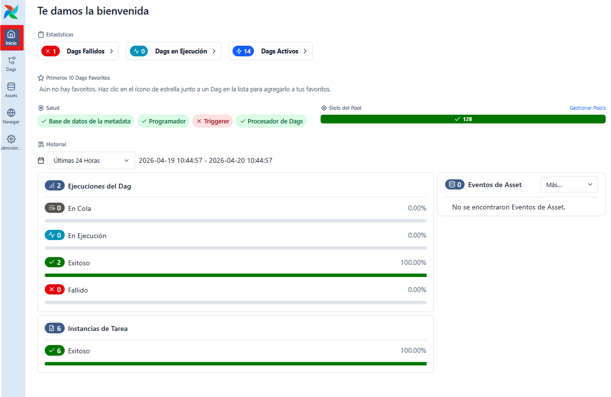
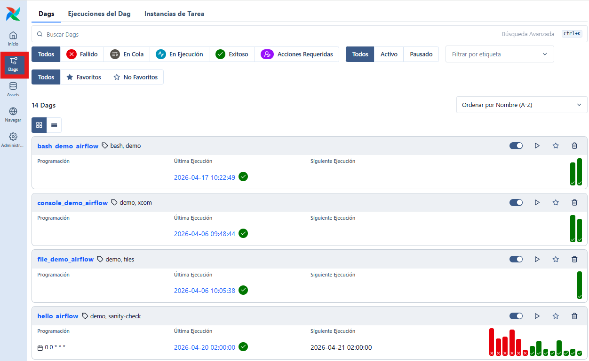
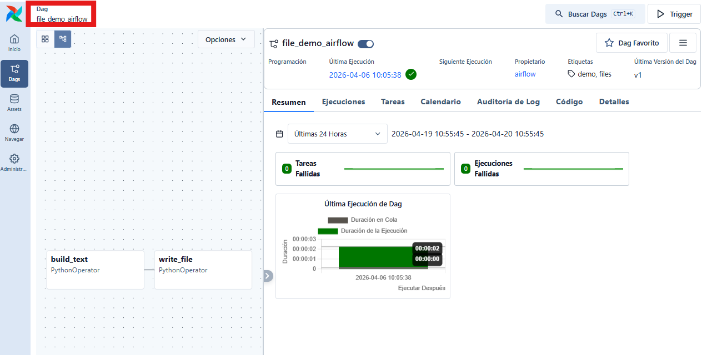
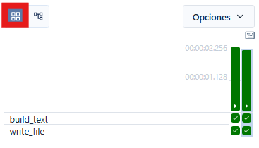
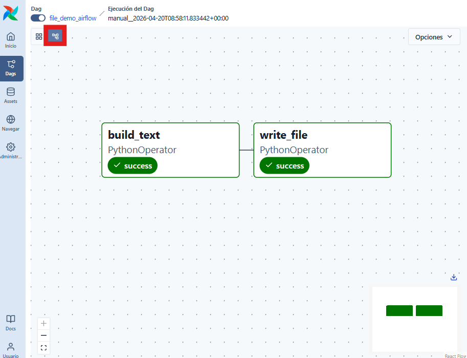
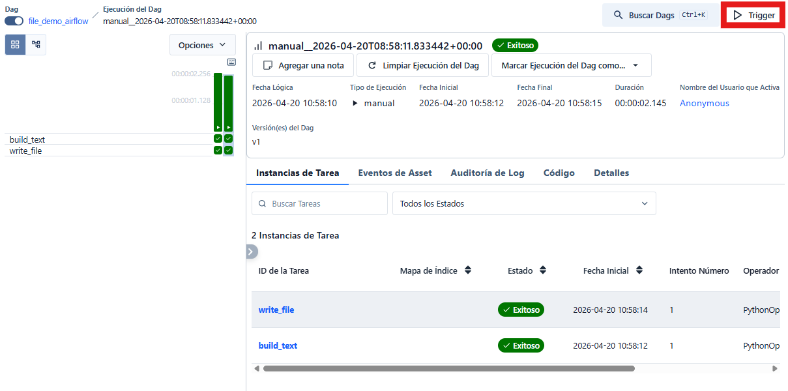
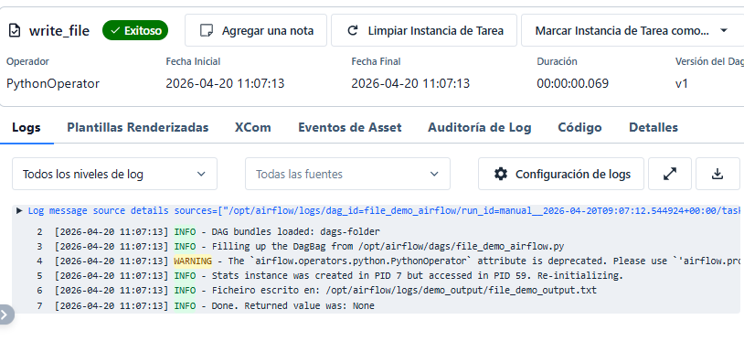
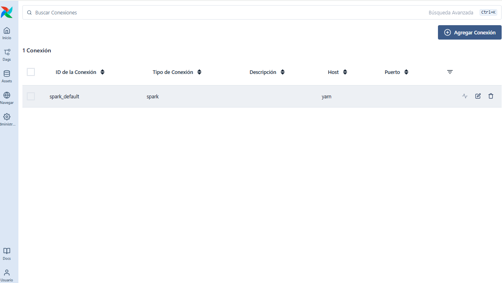
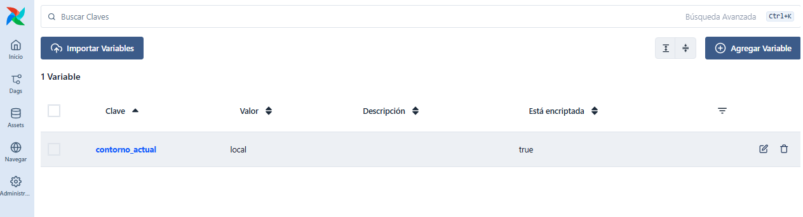

# A interface web de Airflow

Antes de empezar a escribir DAGs, convén dedicar un capítulo curto a entender a interface web de Airflow. A idea non é aprender todos os menús nin memorizar cada opción, senón situarse no entorno e saber onde mirar cando un fluxo aparece, cando se executa e cando falla.

Neste proxecto, a interface está exposta polo servizo `airflow-api-server` e, segundo a configuración vista no capítulo anterior, o acceso real faise en:

- `http://localhost:8091`

## Para que serve a interface web

A interface de Airflow serve principalmente para tres cousas:

- ver os DAGs dispoñibles
- lanzar execucións manuais
- supervisar estados, execucións e logs

Isto é importante porque Airflow define os fluxos en código Python, pero a observación e boa parte da operación diaria fanse desde a interface web.

## Acceso inicial e páxina principal

Ao entrar na URL de Airflow, a aplicación adoita abrir unha pantalla inicial de resumo. Esa páxina principal non coincide necesariamente coa vista específica de `DAGs`, senón que funciona como panel xeral do sistema.

Nela poden aparecer elementos como:

- resumo de execucións recentes
- información sobre DAGs en execución
- información sobre DAGs completados con éxito
- información sobre fallos recentes
- accesos ás distintas seccións principais da interface

Desde un punto de vista docente, esta pantalla é útil para situarse rapidamente no estado xeral da instancia de Airflow.



Figura 1. Páxina principal de Airflow coa vista de resumo xeral.

## A páxina de DAGs

Unha das seccións máis importantes da interface é a páxina específica de `DAGs`. Nela aparece a lista de fluxos rexistrados no sistema e é onde normalmente se comeza a traballar cando queremos localizar un DAG concreto.

Nesta pantalla adoitan verse elementos como:

- nome do DAG
- estado xeral
- etiquetas ou `tags`
- información sobre execucións recentes
- opcións para activar, pausar ou lanzar o DAG

Esta vista é especialmente importante porque permite comprobar rapidamente se un DAG foi detectado e rexistrado correctamente por Airflow.



Figura 2. Páxina de `DAGs` coa lista de fluxos dispoñibles.

## A vista dun DAG concreto

Ao premer sobre un DAG, Airflow mostra unha vista máis detallada dese fluxo. A partir dese momento, o importante xa non é só saber que o DAG existe, senón entender:

- se chegou a executarse
- cantas execucións ten
- en que estado están as súas tarefas
- que accións poden facerse sobre el

Esta vista é a que se empregará con máis frecuencia cando empecemos a crear os nosos propios exemplos.



Figura 3. Vista xeral dun DAG concreto dentro da interface de Airflow.

## Vistas máis útiles para empezar

Airflow ofrece varias maneiras de visualizar un mesmo DAG. Para unha introdución non fai falta coñecelas todas, pero si convén situar as máis útiles.

### Mostrar cuadrícula

A vista `Mostrar cuadrícula` adoita ser a máis práctica para empezar. Permite ver dun golpe:

- as tarefas do DAG
- as distintas execucións
- o estado de cada task instance

É especialmente útil para seguir execucións recentes e detectar rapidamente que tarefa fallou.



Figura 4. Vista `Mostrar cuadrícula` dun DAG.

Cabe destacar algúns aspectos desta vista:

- As execuccións exitosas aparecen en verde, as que fallaron en vermello e as que están en curso en gris.
- Cada fila corresponde a unha tarefa, e cada columna a unha execución concreta.
- Permite acceder aos `Logs` de cada task instance facendo clic sobre a celda correspondente.
- A lonxitude da barra de cada tarefa pode indicar o tempo que tarda en executarse, o que é útil para detectar tarefas que se están a demorar máis do esperado.

### Mostrar gráfico

A vista `Mostrar gráfico` representa o DAG como grafo de dependencias. Esta vista é moi intuitiva para aprender, porque deixa ver con claridade:

- que tarefas existen
- que dependencias hai entre elas
- que orde segue o fluxo

É unha vista especialmente valiosa en docencia, xa que conecta moi ben co concepto teórico de `DAG`.



Figura 5. Vista `Mostrar gráfico` dun DAG.

Descrición: captura da vista `Mostrar gráfico` mostrando a estrutura do DAG como grafo dirixido de tarefas.

### Outras vistas

Airflow inclúe outras vistas, como as relacionadas co histórico de execucións, o calendario ou os detalles dos `runs`. Nun primeiro contacto non é necesario profundar en todas elas. O máis importante ao comezo é sentirse cómodo con `Mostrar cuadrícula`, `Mostrar gráfico` e a navegación básica cara aos `Logs`.

## Lanzamento manual dun DAG

Un dos usos máis habituais da interface, especialmente en contornos de aprendizaxe e probas, é lanzar un DAG manualmente.

Isto resulta útil cando:

- o DAG ten `schedule=None`
- queremos probar un fluxo sen esperar a unha planificación automática
- queremos repetir unha execución concreta de forma controlada

Lanzar un DAG manualmente crea un novo `dag run`. A partir dese momento, Airflow planifica e executa as tarefas segundo as dependencias definidas no DAG.



Figura 6. Lanzamento manual dun DAG desde a interface web.

Abrirase unha xanela de confirmación ao empregar a opción `Trigger DAG`, onde se pode revisar o nome do DAG, a data de execución e outras opcións. Unha vez confirmado, o DAG comezará a executarse segundo a lóxica definida no código.

## Activar e pausar DAGs

Ademais de lanzar execucións manuais, a interface permite activar ou pausar DAGs. Isto é importante porque un DAG pode estar correctamente rexistrado no sistema, pero quedar pausado e non executarse automaticamente.

Desde un punto de vista práctico:

- un DAG activo pode executar os seus `dag runs` segundo a configuración definida
- un DAG pausado segue existindo na interface, pero non lanza execucións programadas

Isto axuda a distinguir dúas ideas que ao principio adoitan mesturarse:

- que un DAG estea visible
- que un DAG estea realmente operativo


Figura 7. Activación e pausa dun DAG desde a interface.

Descrición: captura dos controis da interface empregados para activar ou pausar un DAG.


## Seguimento dunha execución

Unha vez lanzado un DAG, a interface permite seguir a súa evolución. Este punto é clave para aprender a traballar con Airflow, porque axuda a relacionar o código do DAG co comportamento real do sistema.

Ao supervisar unha execución, interesa fixarse en:

- se o `dag run` está en curso, completado ou fallido
- que tarefas remataron correctamente
- que tarefa fallou, se é o caso
- en que punto do fluxo se interrompeu a execución

Neste nivel, a interface convértese nun panel de observación do pipeline.

## DAG runs e task instances na interface

Os conceptos de `dag run` e `task instance` xa apareceron nos capítulos anteriores, pero na interface vólvense especialmente visibles.

Ao consultar un DAG desde a UI, pode observarse que:

- cada execución manual ou programada crea un `dag run`
- dentro de cada `dag run`, cada tarefa ten a súa propia `task instance`
- os estados visibles na interface corresponden a esas execucións concretas, non só á definición abstracta do DAG

Isto é importante porque axuda a entender que un DAG non é unha execución única, senón unha definición que pode correr moitas veces ao longo do tempo.

## Logs das tarefas

Os `Logs` son, moi a miúdo, o primeiro sitio ao que hai que ir cando algo non funciona. Desde a interface, cada tarefa permite acceder aos seus logs concretos.

Neses logs poden verse:

- saídas xeradas por `print(...)`
- saída de comandos do sistema
- mensaxes de erro
- trazas de excepcións

Na práctica, isto significa que a interface non serve só para "ver se algo está verde ou vermello", senón tamén para entender por que ocorreu ese resultado.



Figura 8. Vista de logs dunha tarefa dentro de Airflow.

## Conexións

A interface de Airflow tamén inclúe unha sección de administración na que poden consultarse e definirse `Connections`. 

Para acceder a esta sección hai que facer clic en `Administración` no panel lateral e logo seleccionar `Conexións`.

Unha conexión serve para gardar a información necesaria para acceder a un sistema externo, por exemplo:

- unha base de datos
- un servizo HTTP
- un sistema de mensaxería
- unha configuración de acceso a Spark ou outro compoñente do stack

Desde o punto de vista didáctico, o importante é entender que unha `Connection` permite separar a definición do DAG dos detalles concretos de acceso a outros sistemas.

No caso deste proxecto, isto encaixa moi ben coa idea de non embutir no código máis configuración da necesaria.



Figura 9. Vista da sección de `Connections` en Airflow.

Descrición: captura da sección de administración de conexións mostrando a lista de conexións dispoñibles.

## Variables

Outra sección útil da interface é a de `Variables`. As variables permiten gardar pequenos valores de configuración que poden ser reutilizados por distintos DAGs.

Para acceder a esta sección hai que facer clic en `Administración` no panel lateral e logo seleccionar `Variables`.

Por exemplo, unha variable pode gardar:

- un nome de contorno
- unha ruta lóxica
- un identificador de recurso
- un valor de configuración compartido

É importante non confundilas coas `Connections`:

- unha `Connection` está pensada para representar acceso a un sistema ou servizo
- unha `Variable` está pensada para gardar configuración reutilizable

Nun primeiro contacto con Airflow non é necesario abusar destas opcións, pero convén saber que existen e que forman parte da interface habitual da ferramenta.



Figura 10. Vista da sección de `Variables` en Airflow.

Descrición: captura da sección de variables mostrando valores de configuración gardados na instancia.

## A CLI de Airflow

A interface web é o xeito máis cómodo de explorar Airflow ao empezar, pero non é o único. Airflow tamén dispón dunha liña de comandos ou `CLI` moi útil para consultar información, listar DAGs, revisar conexións e variables ou facer pequenas operacións de administración.

Neste proxecto, o habitual é executar esa CLI dentro do contedor `airflow-scheduler`, por exemplo así:

```bash
docker exec -it airflow-scheduler bash
```

Unha vez dentro do contedor, xa poden executarse os comandos de Airflow.

### DAGs

Para listar os DAGs rexistrados:

```bash
airflow dags list
```

Este comando é moi útil para comprobar se un DAG foi cargado correctamente, mesmo antes de revisalo con detalle na interface.

Para obter unha representación dun DAG concreto:

```bash
airflow dags show dag_id
```

Isto permite ver a estrutura do DAG e confirmar que Airflow o está interpretando como se esperaba.

Se se quere comprobar ou depurar unha tarefa concreta dun DAG:

```bash
airflow tasks test dag_id task_id 2026-01-01
```

Esta orde pode ser útil para lanzar unha task illada nun contexto de proba.

### Conexións

Para listar as conexións dispoñibles:

```bash
airflow connections list
```

Para ver información dunha conexión concreta:

```bash
airflow connections get conn_id
```

Para eliminar unha conexión:

```bash
airflow connections delete conn_id
```

Estes comandos resultan especialmente útiles cando hai que revisar como se está configurando o acceso a Spark, HTTP, Kafka ou outros servizos do stack.

### Variables

Para listar as variables gardadas:

```bash
airflow variables list
```

Para obter o valor dunha variable concreta:

```bash
airflow variables get nome_da_variable
```

Para eliminar unha variable:

```bash
airflow variables delete nome_da_variable
```

Isto é útil tanto para administración básica como para diagnóstico, por exemplo cando unha variable está mal definida ou xa non pode ser lida correctamente.

### Unha idea práctica importante

Desde o punto de vista docente, a CLI non substitúe a interface web, senón que a complementa.

En particular:

- a UI é máis cómoda para observar execucións, tarefas e logs
- a CLI é moi útil para comprobar que Airflow cargou un DAG
- a CLI tamén é moi práctica para revisar ou modificar conexións e variables

Por iso, ao traballar con Airflow convén sentirse cómodo con ambas perspectivas:

- a observación visual desde a interface
- e as comprobacións máis directas desde a liña de comandos

## Filtros e procura

Cando a instancia de Airflow contén poucos DAGs, a navegación é sinxela. Pero a medida que medra o número de fluxos, os filtros e a procura fanse máis importantes.

Na práctica, permiten:

- localizar un DAG polo seu nome
- filtrar por `tags`
- reducir o ruído visual
- centrarse nos fluxos máis relevantes nun momento dado

Mesmo nun entorno docente, convén familiarizarse con estas opcións desde o principio.

## Algunhas ideas clave para non perderse

Ao empezar a traballar coa interface de Airflow convén quedar con estas ideas:

- ver un DAG na interface non significa que xa se executase
- un DAG pode existir e estar pausado
- unha task pode fallar aínda que o DAG estea correctamente rexistrado
- os logs adoitan ser o primeiro lugar onde mirar
- a interface serve para observar e operar, pero os DAGs seguen definíndose en código

## Para seguir avanzando

Unha vez situada a interface, o seguinte paso natural é comezar a escribir DAGs sinxelos e ver como aparecen, como se executan e como se observan desde esta mesma UI.
