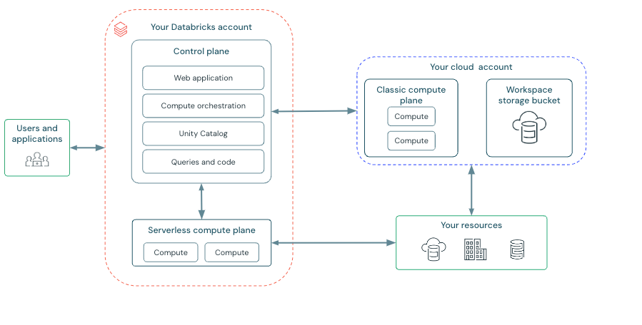

# 1. Introdución a Databricks

## 1.1 Que é Databricks

**Databricks** é unha plataforma integrada orientada ao procesamento, análise e xestión de grandes volumes de datos.

Trátase dunha solución baseada en **Apache Spark** que permite construír arquitecturas de datos completas dentro dun único contorno, seguindo o enfoque coñecido como **lakehouse**.

O modelo *lakehouse* combina características de:

- **data lakes**, que permiten almacenar grandes volumes de datos en bruto  
- **data warehouses**, que permiten realizar consultas eficientes e estruturadas  

Databricks proporciona un conxunto de ferramentas que permiten traballar con datos ao longo de todo o seu ciclo de vida:

- inxestión e integración  
- almacenamento  
- procesamento e transformación  
- análise e exploración  
- execución de pipelines  

Deste modo, Databricks actúa como unha **plataforma end-to-end**, integrando funcionalidades que nunha arquitectura modular corresponderían a distintas ferramentas.

---

## 1.2 Databricks fronte a arquitecturas modulares

Nunha arquitectura modular baseada en ferramentas open source, cada capa do sistema resólvese cunha tecnoloxía diferente.

Por exemplo:

| función | ferramenta (arquitectura modular) |
|--------|-----------------------------------|
| procesamento distribuído | Spark |
| orquestración | Airflow |
| almacenamento | Delta Lake / Iceberg |
| exploración de datos | notebooks / ferramentas BI |

Databricks integra moitas destas capacidades nun único sistema:

| Databricks | equivalente en arquitectura modular |
|-----------|-------------------------------------|
| notebooks | Spark + contorno de desenvolvemento |
| jobs e workflows | Airflow |
| Delta Lake | almacenamento |
| motor Spark integrado | procesamento distribuído |

Este enfoque permite simplificar o desenvolvemento e operación de pipelines, aínda que reduce a flexibilidade na elección de ferramentas.

---

## 1.3 Arquitectura de Databricks

Databricks organízase en varios compoñentes que permiten traballar cos datos de forma integrada.

Figura 1.1. Arquitectura xeral de Databricks.  
Fonte: elaboración propia.

### Workspace

O **workspace** é o contorno de traballo principal.

Nel organízanse:

- notebooks  
- ficheiros  
- workflows  
- configuracións do sistema  

Funciona como punto de acceso para desenvolver e xestionar os pipelines de datos.

---

### Clusters

Os **clusters** son os recursos de computación que executan os procesos.

Están baseados en Apache Spark e permiten:

- procesar grandes volumes de datos  
- executar notebooks  
- lanzar tarefas distribuídas  

Os clusters poden configurarse segundo as necesidades do sistema:

- número de nodos  
- tipo de instancia  
- configuración de memoria e CPU  

---

### Notebooks

Os **notebooks** son contornos interactivos que permiten escribir e executar código.

Admiten diferentes linguaxes:

- Python  
- SQL  
- Scala  
- R  

Os notebooks utilízanse para:

- explorar datos  
- desenvolver transformacións  
- probar procesos  
- visualizar resultados de forma rápida  

---

### Almacenamento (Lakehouse)

Databricks utiliza un modelo de almacenamento baseado en **Delta Lake**, que permite:

- almacenar grandes volumes de datos  
- garantir consistencia e integridade  
- realizar operacións eficientes sobre os datos  

Este modelo combina as vantaxes dos data lakes e dos data warehouses.

---

### Jobs e workflows

Os **jobs** permiten executar tarefas de forma automática.

Permiten:

- programar execucións periódicas  
- definir dependencias entre tarefas  
- automatizar pipelines de datos  

Estes workflows funcionan de maneira similar a ferramentas de orquestración como Airflow, pero integrados dentro da propia plataforma.

---

## 1.4 Papel de Databricks nunha arquitectura de datos

Databricks pode empregarse como núcleo dunha arquitectura de datos completa.

Nun sistema tradicional modular, as distintas capas están separadas. En Databricks, estas capas intégranse nun único contorno:

- inxestión (parcial, mediante conectores)  
- almacenamento (Delta Lake)  
- procesamento (Spark)  
- orquestración (jobs e workflows)  
- análise (notebooks)  

Isto permite construír pipelines de datos completos sen necesidade de integrar múltiples ferramentas externas.

Con todo, este enfoque tamén implica unha maior dependencia da plataforma e menor control directo sobre a infraestrutura.

---

