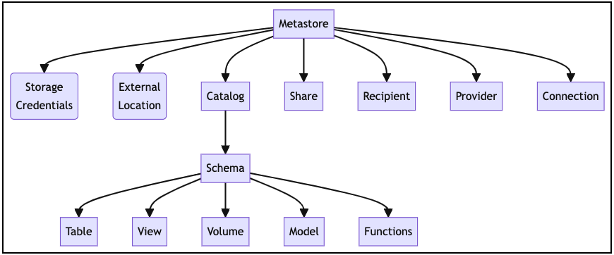
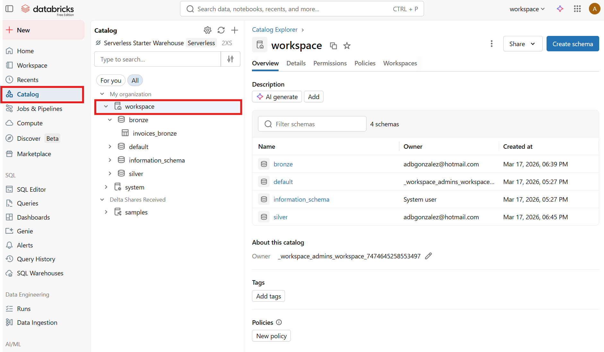
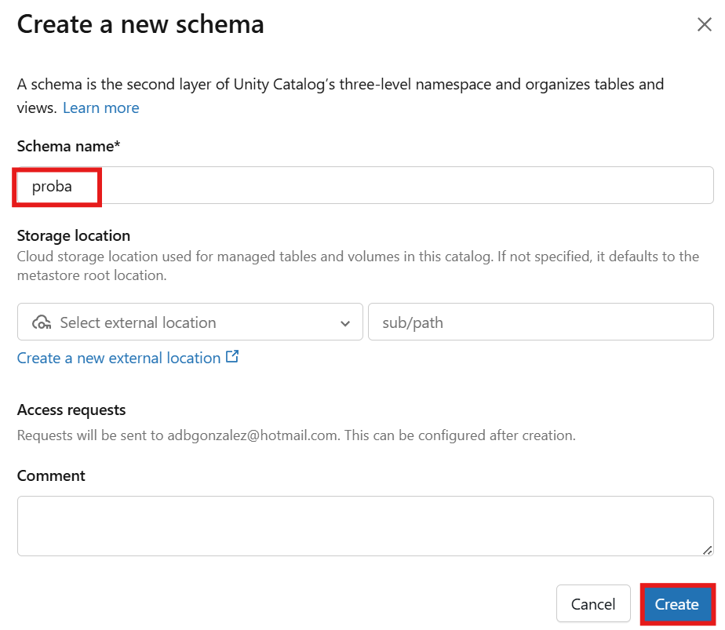
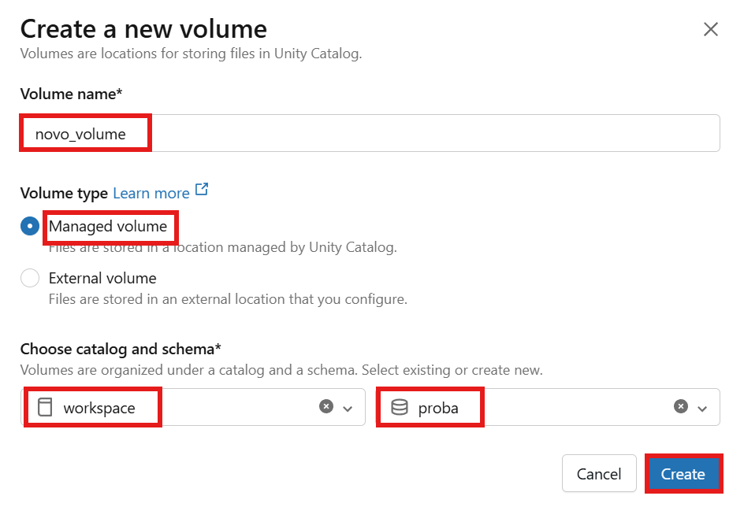
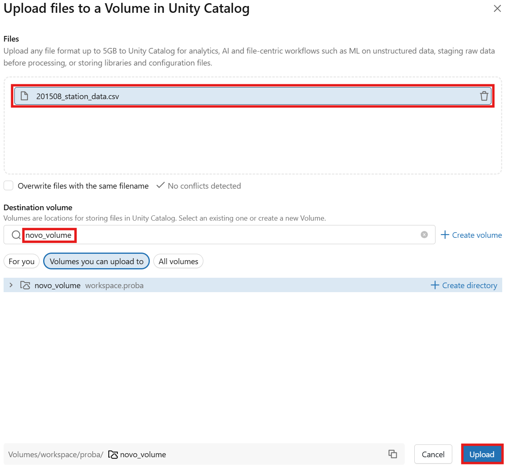
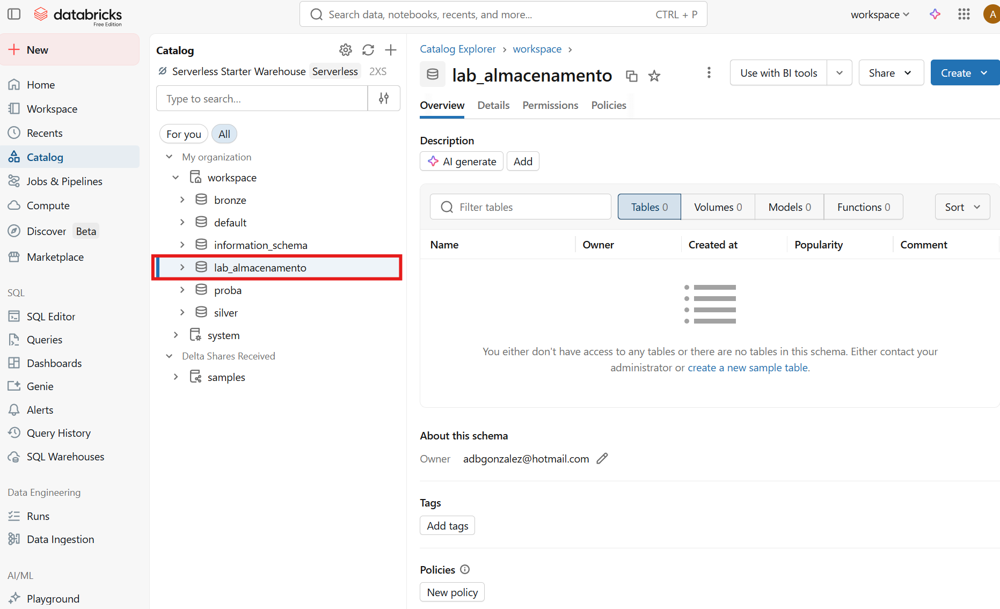
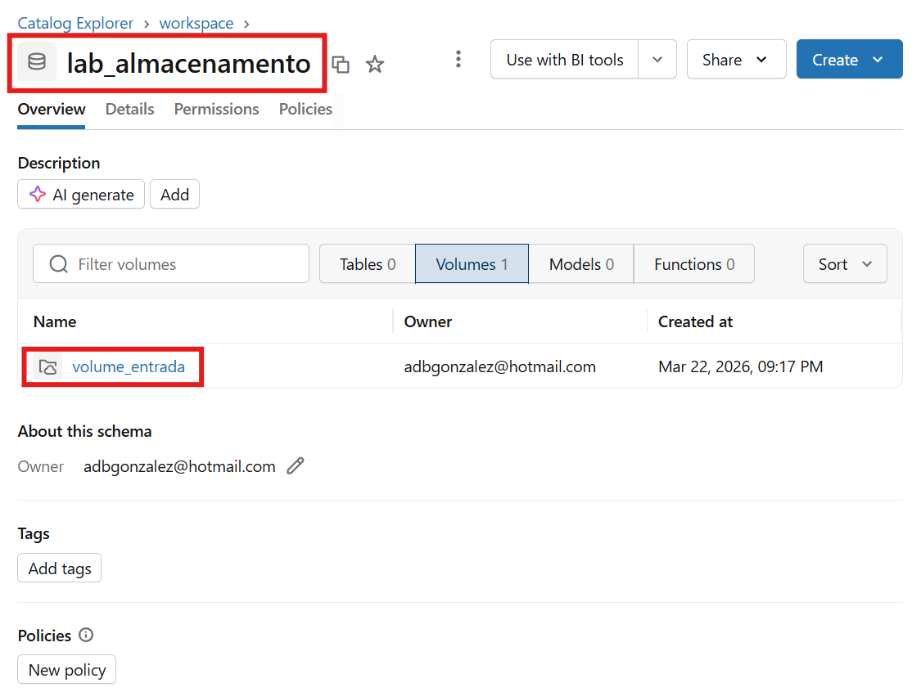
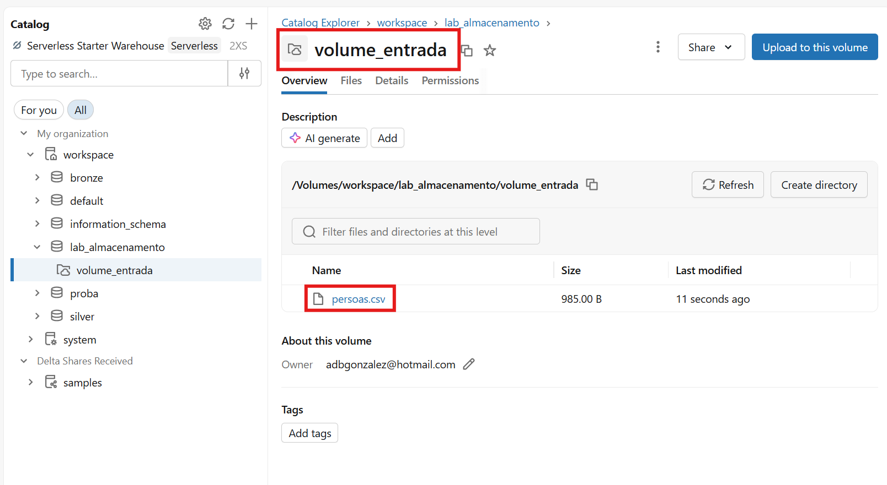
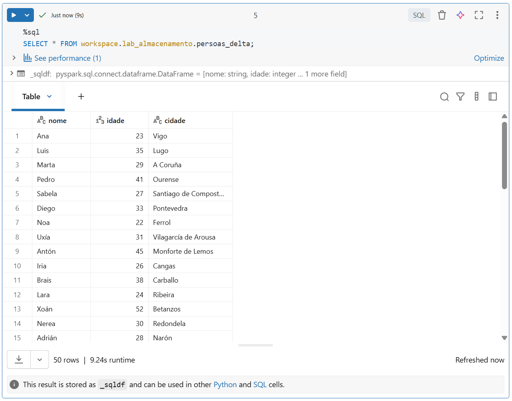

# 3. Xestión de datos en Databricks

## 3.1 O modelo de almacenamento en Databricks

Databricks utiliza un modelo de almacenamento baseado en **Delta Lake**, que constitúe a base do enfoque *lakehouse*.

Neste modelo, os datos almacénanse en formato aberto, baseado en Parquet, pero cunha capa adicional que permite:

- transaccións ACID
- control de versións (*time travel*)
- control de esquema
- mellora do rendemento en consultas

Este enfoque permite combinar as vantaxes dos *data lakes* (flexibilidade e escalabilidade) coas dos *data warehouses* (consistencia e eficiencia).

---

## 3.2 Organización dos datos en Databricks

En Databricks, os datos poden entenderse desde dous niveis complementarios:

- **nivel físico**, no que os datos existen como ficheiros almacenados en cloud
- **nivel lóxico**, no que os datos se organizan como obxectos accesibles desde SQL e desde Spark

---

### 3.2.1 Ficheiros

Os ficheiros representan o nivel máis básico de almacenamento.

Poden estar en formatos como:

- CSV
- JSON
- Parquet
- Delta

Estes ficheiros poden almacenarse en:

- DBFS (Databricks File System)
- almacenamento cloud, como S3, ADLS ou GCS
- volumes definidos en Unity Catalog

Desde Databricks, pódese acceder a estes ficheiros mediante rutas.

Exemplo:

```python
df = spark.read.csv("/Volumes/exemplo/esquema/volume/datos.csv", header=True)
df.show()
```

Traballar directamente con ficheiros é útil para:

- importar datos
- explorar información en bruto
- realizar procesamentos iniciais

Con todo, este enfoque presenta limitacións en termos de organización, control e rendemento.

---

### 3.2.2 Táboas

As táboas representan un nivel superior de abstracción.

En lugar de traballar directamente cos ficheiros, os datos organízanse en estruturas que permiten:

- consultas mediante SQL
- control de acceso
- xestión do esquema
- mellor rendemento

En Databricks, as táboas baséanse habitualmente en **Delta Lake**.

Exemplo:

```sql
SELECT * FROM catalogo.esquema.persoas;
```

---

### 3.2.3 Relación entre ficheiros e táboas

Unha táboa en Databricks non deixa de estar apoiada sobre ficheiros almacenados fisicamente.

Noutras palabras:

- os **ficheiros** conteñen os datos reais
- as **táboas** proporcionan unha forma estruturada e gobernada de acceder a eses datos

Esta separación entre nivel físico e nivel lóxico é fundamental para comprender o funcionamento do sistema.

---

## 3.3 Unity Catalog

**Unity Catalog** é o sistema de gobernanza de datos de Databricks.

Permite organizar os datos, centralizar permisos e definir unha estrutura común para acceder a táboas e ficheiros dentro da plataforma.

---

### 3.3.1 Xerarquía de obxectos

Unity Catalog introduce unha xerarquía de obxectos que organiza os activos de datos.

A estrutura xeral pode resumirse así:

`metastore / catálogo / esquema / táboa`

ou, no caso de ficheiros non tabulares:

`metastore / catálogo / esquema / volume / ficheiros`



Figura 3.1. Xerarquía de obxectos en Unity Catalog.  
Fonte: elaboración propia.



Figura 3.2. Catalog Explorer en Databricks.  
Fonte: elaboración propia.


---

#### Metastore

O **metastore** é o nivel superior da organización.

Actúa como o contedor global da metadata de Unity Catalog e define a estrutura xeral sobre a que se crean catálogos, esquemas, táboas e volumes.

Nun contexto introdutorio, pode entenderse como a capa que engloba toda a organización lóxica dos datos.

---

#### Catálogo

O **catálogo** é o primeiro nivel visible da xerarquía.

Permite:

- separar datos por proxectos, departamentos ou contornos
- establecer políticas de acceso a un nivel alto
- agrupar esquemas relacionados

Un catálogo tamén pode asociarse a unha localización de almacenamento por defecto.

En contornos de aprendizaxe, é habitual traballar sobre un catálogo xa dispoñible, como `workspace`, aínda que tamén poden crearse novos catálogos se se desexa organizar mellor os datos.

---

#### Esquema

O **esquema** (ou base de datos) é o segundo nivel da xerarquía.

Serve para agrupar obxectos relacionados dentro dun catálogo, principalmente:

- táboas
- volumes

Do mesmo modo que o catálogo, un esquema pode ter unha localización de almacenamento asociada para os seus obxectos xestionados.

---

#### Táboa

A **táboa** é o obxecto utilizado para traballar con datos tabulares.

É o elemento principal cando se queren:

- realizar consultas SQL
- aplicar permisos de acceso
- manter esquema e consistencia
- integrar os datos en procesos analíticos

---

#### Volume

O **volume** é o obxecto utilizado para traballar con datos non tabulares.

Permite almacenar e acceder a ficheiros dentro da estrutura de Unity Catalog, por exemplo:

- CSV
- JSON
- imaxes
- modelos
- documentos

Os volumes resultan especialmente útiles nas fases de inxestión e preparación de datos.

---

### 3.3.2 Táboas e volumes xestionados e externos

Tanto as táboas como os volumes poden ser de dous tipos:

- **xestionados (managed)**
- **externos (external)**

#### Obxectos xestionados

Nun obxecto xestionado:

- Databricks controla a localización de almacenamento
- o sistema xestiona os datos automaticamente
- ao eliminar o obxecto, elimínanse tamén os datos asociados

Este é o comportamento máis sinxelo e habitual en contornos de aprendizaxe.

#### Obxectos externos

Nun obxecto externo:

- os datos almacénanse nunha localización externa
- Unity Catalog rexistra e referencia esa localización
- ao eliminar o obxecto, os datos non se eliminan automaticamente

Este enfoque é útil cando os datos xa existen fóra de Databricks ou cando se necesita maior control sobre o almacenamento.

---

### 3.3.3 Funcións principais de Unity Catalog

Unity Catalog engade unha capa de control sobre os datos, permitindo:

- definir permisos de acceso a nivel de catálogo, esquema, táboa e volume
- controlar que usuarios ou grupos poden consultar ou modificar obxectos
- manter unha organización consistente dos activos de datos
- centralizar a gobernanza en diferentes contornos de traballo

---

### 3.3.4 Importancia en contornos reais

En sistemas de datos reais, non abonda con almacenar e procesar información. Tamén é necesario:

- garantir a seguridade dos datos
- controlar quen accede á información
- manter unha organización clara e consistente

Unity Catalog permite cubrir estas necesidades dentro de Databricks.

---

### 3.3.5 Gobernanza de datos e control de acceso

A **data governance** fai referencia ao conxunto de normas, permisos e mecanismos que permiten controlar como se organizan, protexen e comparten os datos.

En Databricks, esta capa de gobernanza intégrase principalmente a través de Unity Catalog.

Aquí non se desenvolverá en profundidade a configuración de permisos, xa que o foco está na carga, transformación e consulta de datos. Con todo, convén coñecer que estas capacidades existen e que son fundamentais en contornos profesionais.

Entre as funcións máis habituais da gobernanza de datos atópanse:

- definir quen pode acceder a un catálogo, esquema, táboa ou volume
- controlar quen pode ler, modificar ou crear obxectos
- limitar o acceso a parte da información segundo o usuario ou grupo
- aplicar políticas de seguridade sobre datos sensibles

---

#### Comandos básicos de permisos

En SQL, a xestión de permisos realízase habitualmente mediante instrucións como `GRANT` e `REVOKE`.

Exemplos básicos:

```sql
GRANT USE CATALOG ON CATALOG workspace TO analistas;
GRANT USE SCHEMA ON SCHEMA workspace.exemplo_esquema TO analistas;
GRANT SELECT ON TABLE workspace.exemplo_esquema.persoas TO analistas;
```

Estas instrucións permiten:

- dar acceso a un catálogo
- permitir o uso dun esquema
- conceder permiso de lectura sobre unha táboa

Tamén existe a operación inversa:

```sql
REVOKE SELECT ON TABLE workspace.exemplo_esquema.persoas FROM analistas;
```

---

#### Herdanza de permisos

Unity Catalog segue unha xerarquía de obxectos. Isto implica que, en moitos casos, os permisos definidos en niveis superiores poden aplicarse tamén a niveis inferiores.

Por exemplo, se un grupo ten permiso para usar un catálogo e un esquema, poderá traballar cos obxectos dese ámbito sempre que teña tamén os permisos específicos necesarios.

Este modelo facilita a administración en contornos grandes, xa que evita definir cada permiso obxecto por obxecto.

---

#### Row security e column security

Ademais dos permisos básicos, os sistemas modernos de gobernanza poden aplicar restricións máis finas sobre os datos.

Entre os conceptos máis importantes destacan:

- **row security**: permite que distintos usuarios vexan filas diferentes dunha mesma táboa
- **column security**: permite ocultar ou restrinxir certas columnas segundo o perfil de acceso
- **data masking**: permite mostrar datos parcialmente ocultos, por exemplo en columnas con información persoal ou financeira

Estas técnicas son habituais cando se traballa con datos sensibles, como:

- información persoal
- datos financeiros
- datos médicos

Aquí non se configurarán estas políticas, pero é importante saber que forman parte da gobernanza de datos en contornos reais.

---

## 3.4 Creación de estruturas de datos

En Databricks pódense crear catálogos, esquemas, volumes e táboas utilizando SQL. Nun contexto introdutorio, tamén é frecuente traballar dentro dun catálogo xa existente, como `workspace`, pero non hai inconveniente en crear catálogos novos cando se queren separar prácticas, proxectos ou conxuntos de datos.

---

### 3.4.1 Crear un catálogo

Pódese crear un catálogo empregando SQL dende un notebook:

```sql
CREATE CATALOG IF NOT EXISTS exemplo_catalogo;
```

Tamén se pode crear un catálogo desde a interface gráfica, usando a opción `Create` en Catalog Explorer e completando os datos básicos do novo catálogo.

---

### 3.4.2 Crear un esquema

Pódese crear un esquema empregando SQL dende un notebook:

```sql
CREATE SCHEMA IF NOT EXISTS workspace.exemplo_esquema;
```

Tamén se pode crear un esquema desde a interface gráfica, seleccionando previamente o catálogo e empregando a opción `Create` para engadir un novo esquema.



Figura 3.3. Creación dun esquema en Databricks.  
Fonte: elaboración propia.

---

### 3.4.3 Crear un volume

Pódese crear un volume para almacenar ficheiros empregando SQL dende un notebook:

```sql
CREATE VOLUME IF NOT EXISTS workspace.exemplo_esquema.volume_datos;
```

Tamén se pode crear un volume desde a interface gráfica (despregando `create` e seleccionando `volume`), o que permite seleccionar o tipo de volume (managed ou external) e configurar outras opcións.



Figura 3.4. Creación dun volume en Databricks.  
Fonte: elaboración propia.

---

### 3.4.4 Crear unha táboa

Pódese crear unha táboa empregando SQL dende un notebook:

```sql
CREATE TABLE workspace.exemplo_esquema.persoas (
    nome STRING,
    idade INT
);
```

Tamén se pode crear unha táboa desde a interface gráfica, entrando no esquema correspondente e seleccionando a opción para crear unha nova táboa. A interface permite definir columnas, tipos de datos e outras opcións básicas.

---

### 3.4.5 Inserir datos

Unha vez creada a táboa, pódense inserir rexistros empregando SQL dende un notebook:

```sql
INSERT INTO workspace.exemplo_esquema.persoas VALUES
("Ana", 23),
("Luis", 35),
("Marta", 29);
```

Tamén se poden cargar datos desde a interface en determinados fluxos guiados de Databricks, especialmente cando se parte dun ficheiro subido á plataforma. Para un primeiro contacto, o uso de SQL nun notebook adoita ser a opción máis clara.

---

### 3.4.6 Consultar datos

Os datos dunha táboa pódense consultar empregando SQL dende un notebook:

```sql
SELECT * FROM workspace.exemplo_esquema.persoas;
```

Tamén é posible inspeccionar a táboa desde a interface gráfica, abrindo o obxecto en Catalog Explorer para ver o esquema, unha vista previa dos datos e algunhas opcións de xestión.

---

### 3.4.7 Nota sobre o uso de catálogos

Neste módulo utilizaranse frecuentemente exemplos co catálogo `workspace`, por simplicidade. Con todo, pódense crear catálogos novos sen problema e, de feito, pode ser recomendable facelo para separar prácticas, proxectos ou conxuntos de datos.

---

## 3.5 Táboas Delta

Por defecto, as táboas creadas en Databricks adoitan utilizar o formato **Delta Lake**, xa presentado anteriormente.

Isto permite:

- realizar actualizacións e borrados
- consultar versións anteriores dos datos
- mellorar o rendemento das consultas

Exemplo de consulta de versións:

```sql
DESCRIBE HISTORY workspace.exemplo_esquema.persoas;
```

---

## 3.6 Importación de datos

Para traballar con datos en Databricks é necesario importalos desde distintas fontes.

Os datos poden proceder de:

- ficheiros (CSV, JSON, Parquet)
- bases de datos
- APIs
- sistemas de *streaming*

Nesta sección os exemplos céntranse na carga de ficheiros, que é o caso máis habitual en contornos de aprendizaxe.

---

### 3.6.1 Onde se almacenan os ficheiros

Na actualidade, a forma recomendada de xestionar ficheiros en Databricks é mediante **volumes**, integrados en Unity Catalog.

Un volume permite gardar ficheiros dentro da estrutura lóxica da plataforma:

`catálogo / esquema / volume / ficheiros`

Este enfoque facilita que os ficheiros tamén formen parte do modelo de gobernanza de datos.

---

### 3.6.2 Subida de ficheiros

A forma máis habitual de cargar datos é mediante a interface gráfica de Databricks.

Proceso xeral:

1. Acceder á sección **Data ingestion**
2. Seleccionar a opción **Upload files to a volume**
3. Escoller o catálogo e o esquema
4. Crear ou seleccionar un volume
5. Subir o ficheiro desde o equipo local

Durante o proceso de carga, é habitual seleccionar:

- un catálogo xa dispoñible
- un esquema
- un tipo de volume

No caso do tipo de volume, existen dúas opcións:

- **managed volume**: Databricks xestiona automaticamente o almacenamento
- **external volume**: os datos almacénanse nun sistema externo

Para un uso básico en conta gratuíta, a opción máis sinxela e recomendable é **managed volume**.

Para este módulo empregarase normalmente **managed volume**, xa que simplifica a xestión dos datos.



Figura 3.5. Subida de ficheiros a un volume en Databricks.  
Fonte: elaboración propia.

---

### 3.6.3 Lectura de ficheiros

Unha vez cargados, os ficheiros poden lerse mediante Apache Spark.

Exemplo de lectura dun ficheiro CSV:

```python
df = spark.read.csv(
    "/Volumes/workspace/exemplo_esquema/volume_datos/datos.csv",
    header=True,
    inferSchema=True
)

df.show()
```

Tamén se poden ler outros formatos:

```python
df = spark.read.parquet(
    "/Volumes/workspace/exemplo_esquema/volume_datos/datos.parquet"
)
```

---

### 3.6.4 Uso de DataFrames

Os datos cargados almacénanse nun **DataFrame**, que permite:

- realizar transformacións
- aplicar filtros
- preparar os datos para o seu almacenamento posterior

Este é o paso intermedio habitual antes de gardar os datos como táboa.

---

### 3.6.5 Gardar datos como táboa

Unha vez procesados, os datos poden almacenarse como táboa en Databricks.

```python
df.write.saveAsTable("workspace.exemplo_esquema.persoas")
```

Isto permite:

- consultar os datos mediante SQL
- aplicar control de acceso
- mellorar o rendemento das consultas

---

### 3.6.6 Nota sobre DBFS

Databricks tamén permite utilizar rutas baseadas en **DBFS**, como:

```text
/FileStore/datos.csv
```

Con todo, este enfoque é máis tradicional. O uso de volumes é actualmente a opción recomendada, xa que se integra mellor con Unity Catalog e co sistema de gobernanza de datos.

---

### 3.6.7 Resumo

O proceso típico de importación de datos en Databricks pode resumirse así:

`ficheiro / volume / DataFrame / transformación / táboa`

Este fluxo forma parte da fase de inxestión dun pipeline de datos.

---

## 3.7 Relación coa arquitectura modular

Nunha arquitectura modular, o almacenamento e a xestión de datos realízanse mediante ferramentas separadas, como:

- HDFS
- S3
- Delta Lake ou Iceberg

En Databricks, estas funcionalidades intégranse nun único sistema, simplificando a xestión dos datos e a súa explotación.

Unity Catalog reforza este modelo ao engadir unha capa común de organización, permisos e gobernanza sobre táboas e ficheiros.

---

## 3.8 Laboratorio guiado

Esta práctica guiada resume o fluxo básico de traballo con almacenamento en Databricks:

1. crear un esquema
2. crear un volume
3. subir un ficheiro CSV
4. lelo con Spark
5. gardalo como táboa Delta

O laboratorio está pensado para contornos de aprendizaxe e emprega o catálogo `workspace` como referencia, aínda que tamén podería adaptarse facilmente a un catálogo creado polo usuario.

---

### 3.8.1 Obxectivo

Ao finalizar esta práctica, deberíase ser capaz de:

- organizar un espazo de traballo dentro de Unity Catalog
- cargar un ficheiro nun volume
- ler o ficheiro desde un notebook
- converter os datos nunha táboa Delta

---

### 3.8.2 Preparación

Antes de comezar, é necesario dispoñer de:

- acceso a Databricks
- un notebook en Python
- o ficheiro [persoas.csv](/c:/repo/bda/03.pipelines/Databricks/data/persoas.csv), situado no directorio `Databricks/data`

Este ficheiro contén datos de exemplo coas columnas `nome`, `idade` e `cidade`, e empregarase no laboratorio como fonte de entrada para a carga no volume e a posterior creación da táboa Delta.

---

### 3.8.3 Paso 1. Crear un esquema

Executar en SQL:

```sql
CREATE SCHEMA IF NOT EXISTS workspace.lab_almacenamento;
```

Este esquema servirá para gardar tanto o volume como a táboa final.



Figura 3.6. Esquema do laboratorio en Databricks.  
Fonte: elaboración propia.

---

### 3.8.4 Paso 2. Crear un volume

Executar en SQL:

```sql
CREATE VOLUME IF NOT EXISTS workspace.lab_almacenamento.volume_entrada;
```

Este volume utilizarase para almacenar o ficheiro CSV.



Figura 3.7. Volume do laboratorio en Databricks.  
Fonte: elaboración propia.

---

### 3.8.5 Paso 3. Subir un ficheiro ao volume

Desde a interface de Databricks:

1. acceder a **Catalog**
2. abrir o catálogo `workspace`
3. abrir o esquema `lab_almacenamento`
4. abrir o volume `volume_entrada`
5. seleccionar a opción para subir ficheiros
6. cargar o ficheiro `persoas.csv`

Unha vez rematado o proceso, o ficheiro debería quedar dispoñible nunha ruta semellante a esta:

```text
/Volumes/workspace/lab_almacenamento/volume_entrada/persoas.csv
```



Figura 3.8. Ficheiro cargado no volume do laboratorio.  
Fonte: elaboración propia.

---

### 3.8.6 Paso 4. Ler o ficheiro desde Spark

Nun notebook de Python:

```python
df = spark.read.csv(
    "/Volumes/workspace/lab_almacenamento/volume_entrada/persoas.csv",
    header=True,
    inferSchema=True
)

df.show()
```

Este paso carga o CSV nun DataFrame de Spark.

Opcionalmente, pódese comprobar o esquema detectado:

```python
df.printSchema()
```

---

### 3.8.7 Paso 5. Gardar os datos como táboa Delta

Unha vez cargados os datos, poden gardarse como táboa:

```python
df.write.mode("overwrite").saveAsTable("workspace.lab_almacenamento.persoas_delta")
```

Esta instrución crea unha táboa Delta dentro do esquema do laboratorio.

---

### 3.8.8 Paso 6. Consultar a táboa

En SQL:

```sql
SELECT * FROM workspace.lab_almacenamento.persoas_delta;
```

Tamén se pode consultar o historial da táboa:

```sql
DESCRIBE HISTORY workspace.lab_almacenamento.persoas_delta;
```



Figura 3.9. Táboa Delta creada no laboratorio.  
Fonte: elaboración propia.

---

### 3.8.9 Resultado esperado

Ao finalizar a práctica, deberían existir os seguintes elementos:

- o esquema `workspace.lab_almacenamento`
- o volume `workspace.lab_almacenamento.volume_entrada`
- o ficheiro `persoas.csv` dentro do volume
- a táboa `workspace.lab_almacenamento.persoas_delta`

Isto permite ver con claridade a relación entre:

- ficheiro almacenado nun volume
- lectura mediante Spark
- escritura final nunha táboa Delta

---

### 3.8.10 Extensión opcional

Como ampliación, pódense realizar algunhas probas adicionais:

- filtrar as persoas con idade superior a 30
- gardar o resultado nunha segunda táboa
- crear unha vista SQL sobre a táboa
- repetir o proceso con outro ficheiro CSV

---

