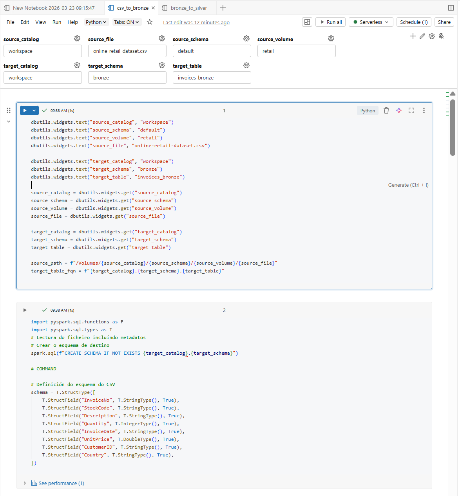
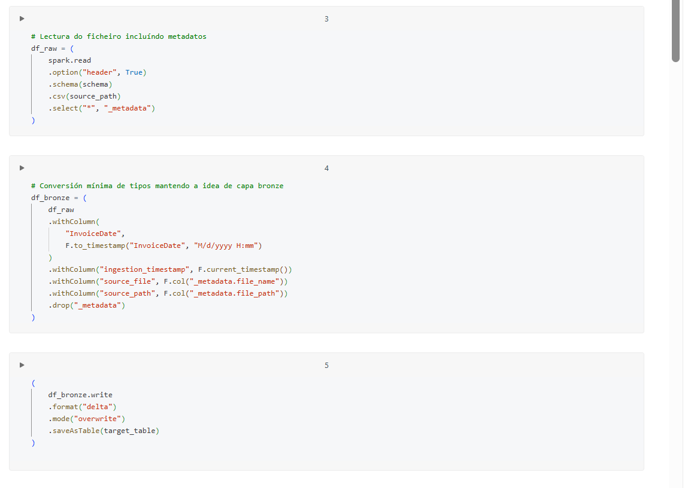
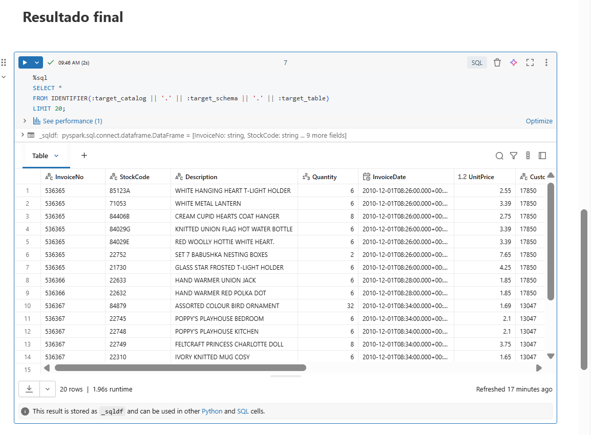
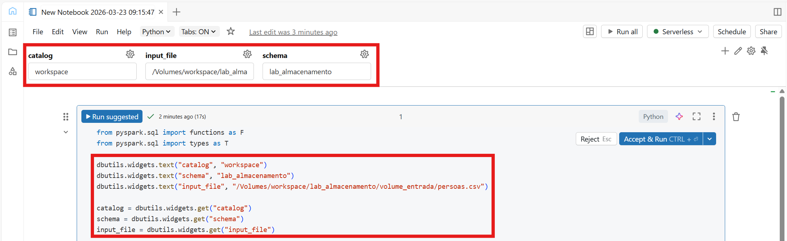

# 4. Notebooks e parametrización en Databricks

## 4.1 O papel dos notebooks en Databricks

Os **notebooks** son un dos elementos centrais de Databricks.

Permiten combinar nun mesmo contorno:

- código
- consultas SQL
- explicacións en texto
- resultados
- visualizacións

Nas seguintes imaxes pódese ver un exemplo dun notebook en Databricks con distintos tipos de celas:

- Widget de texto para recibir parámetros, cela de definición de variables e cela de importación de librarías e definción de esquemas:

Figura 4.1. Exemplo dun notebook en Databricks cunha cela de documentación.  

- Cela con código Python para ler datos, aplicar transformacións e gardar o resultado:

Figura 4.2. Exemplo dun notebook en Databricks cunha cela en Python.  

- Cela en de texto en Markdown e cela en SQL para amosar os resultados:

Figura 4.3. Exemplo dun notebook en Databricks cunha cela en SQL.  


Nun contexto de datos, isto é especialmente útil porque facilita:

- explorar información
- desenvolver transformacións
- probar lóxica paso a paso
- documentar o proceso dentro do propio notebook

En Databricks, os notebooks non son só unha ferramenta de exploración. Tamén poden formar parte de pipelines, workflows e procesos automatizados.

---

## 4.2 Linguaxes e bloques de execución

Un notebook de Databricks pode conter celas en distintas linguaxes.

As máis habituais son:

- Python
- SQL
- Scala
- R

Isto permite combinar, por exemplo:

- lectura e transformación en Python
- consultas sobre táboas en SQL
- explicacións en Markdown

En moitos casos, cada cela utiliza a linguaxe principal do notebook, pero tamén se poden empregar **comandos máxicos** para cambiar a linguaxe dunha cela concreta.

Por exemplo:

```python
%python
print("Ola desde Python")
```

```sql
%sql
SELECT * FROM workspace.default.persoas LIMIT 10;
```

Os comandos máis habituais son:

- `%python`
- `%sql`
- `%md`

Este é un dos aspectos máis característicos de Databricks respecto doutros contornos de desenvolvemento máis tradicionais.

---

## 4.3 Bloques SQL dentro do notebook

Un notebook de Databricks permite executar SQL directamente, sen necesidade de cambiar a outra ferramenta.

Isto resulta útil para:

- consultar táboas
- crear vistas
- validar resultados
- facer operacións DDL e DML

Exemplo:

```sql
%sql
CREATE SCHEMA IF NOT EXISTS workspace.default_exemplo;
```

```sql
%sql
SELECT cidade, COUNT(*) AS total
FROM workspace.pipeline_lab.persoas_gold
GROUP BY cidade
ORDER BY total DESC;
```

Este uso combinado de Python e SQL no mesmo notebook é especialmente práctico en contornos docentes e en tarefas de análise e enxeñaría de datos.

---

## 4.4 Parametrización con widgets

Un dos elementos máis útiles dos notebooks en Databricks é a capacidade de recibir **parámetros**.

Isto permite executar o mesmo notebook con valores distintos, por exemplo cambiando:

- o catálogo
- o esquema
- a ruta dun ficheiro
- o nome dunha táboa
- a data de procesamento


Figura 4.4. Parametrización dun notebook en Databricks mediante widgets.  

En Databricks, isto faise habitualmente mediante `dbutils.widgets`.

Exemplo en Python:

```python
dbutils.widgets.text("catalog", "workspace")
dbutils.widgets.text("schema", "pipeline_lab")
dbutils.widgets.text("table_name", "persoas_bronze")
```

Despois, os valores recupéranse así:

```python
catalog = dbutils.widgets.get("catalog")
schema = dbutils.widgets.get("schema")
table_name = dbutils.widgets.get("table_name")
```

No caso de SQL, tamén poden empregarse parámetros dentro da propia consulta.

Unha sintaxe tradicional en notebooks de Databricks consiste en usar `${...}`:

```sql
%sql
CREATE SCHEMA IF NOT EXISTS ${catalog}.${schema};
```

Esta forma segue sendo habitual e pode funcionar correctamente. Con todo, en contornos actuais de Databricks pode aparecer un *warning* indicando que a consulta contén un parámetro con `$` e recomendando migrar á sintaxe de **parameter markers** con `:param`.

Por exemplo, se se quere construír o nome completo dunha táboa a partir de varios parámetros, a forma recomendada é:

```sql
%sql
SELECT *
FROM IDENTIFIER(:catalog || '.' || :schema || '.' || :table_name)
LIMIT 20;
```

A versión equivalente coa sintaxe anterior sería:

```sql
%sql
SELECT * FROM ${catalog}.${schema}.${table_name} LIMIT 20;
```

En consecuencia:

- `${...}` segue sendo frecuente e convén recoñecelo
- `:param` está máis aliñado coas recomendacións actuais de Databricks
- cando se constrúe o nome dun obxecto SQL completo, como unha táboa, adoita empregarse `IDENTIFIER(...)`

Este mecanismo é fundamental para facer notebooks reutilizables.

---

## 4.5 Parametrización e Workflows

A parametrización cobra aínda máis importancia cando un notebook se executa desde un **Workflow**.

Nese caso, o workflow pode pasar valores ao notebook e este adaptará o seu comportamento segundo os parámetros recibidos.

Por exemplo, un mesmo notebook pode usarse para:

- cargar datos nun esquema de probas
- executar a mesma lóxica nun esquema de produción
- apuntar a táboas distintas
- procesar datas diferentes

Isto evita duplicar notebooks só para cambiar nomes, rutas ou configuracións pequenas.

En consecuencia, un notebook ben parametrizado adoita ser:

- máis reutilizable
- máis fácil de manter
- máis fácil de integrar en jobs e workflows

---

## 4.6 Estrutura recomendada dun notebook

Unha boa práctica moi útil é organizar o notebook en bloques claros.

Unha estrutura habitual pode ser esta:

1. definición de parámetros e variables
2. importación de librarías
3. definición de esquemas e configuración
4. lectura de datos
5. limpeza e transformación
6. escritura do resultado
7. validación final

Este enfoque fai que o notebook sexa máis:

- lexible
- reutilizable
- fácil de depurar

---

## 4.7 Boas prácticas de estilo

Nun contexto de Databricks, algunhas boas prácticas resultan especialmente recomendables.

### Definir variables ao comezo

É moi útil reservar unha cela inicial para declarar os elementos principais do notebook:

- catálogo
- esquema
- ruta de entrada
- ruta de saída
- nomes de táboas

Exemplo:

```python
catalog = "workspace"
schema = "pipeline_lab"
volume_path = "/Volumes/workspace/lab_almacenamento/volume_entrada"
input_file = f"{volume_path}/persoas.csv"
bronze_table = f"{catalog}.{schema}.persoas_bronze"
silver_table = f"{catalog}.{schema}.persoas_silver"
gold_table = f"{catalog}.{schema}.persoas_gold"
```

Isto evita repetir cadeas literais ao longo do notebook e facilita cambiar a configuración nun único punto.

### Importar funcións e tipos con alias

En PySpark, é habitual empregar:

```python
from pyspark.sql import functions as F
from pyspark.sql import types as T
```

Este patrón mellora a lexibilidade e é moi común en proxectos reais.

Exemplo:

```python
df = df.withColumn("cidade", F.initcap(F.col("cidade")))
```

### Definir esquemas cando sexa posible

Aínda que `inferSchema=True` é útil para exemplos rápidos, en procesos máis controlados adoita ser mellor definir explicitamente o esquema.

Exemplo:

```python
schema_persoas = T.StructType([
    T.StructField("nome", T.StringType(), True),
    T.StructField("idade", T.IntegerType(), True),
    T.StructField("cidade", T.StringType(), True),
])
```

Isto fai o proceso máis estable e previsible.

### Separar lectura, limpeza e escritura

Outra boa práctica importante é non mesturar todo nun único bloque grande.

É preferible:

- ler os datos nunha cela
- limpalos noutra
- gardalos nunha terceira

Isto facilita:

- depuración
- reutilización
- revisión do notebook

---

## 4.8 Exemplo de notebook parametrizado

O seguinte exemplo resume varias das prácticas anteriores:

A primeira cela define os parámetros de entrada:

```python
dbutils.widgets.text("catalog", "workspace")
dbutils.widgets.text("schema", "pipeline_lab")
dbutils.widgets.text("input_file", "/Volumes/workspace/lab_almacenamento/volume_entrada/persoas.csv")
```

Nunha segunda cela recupéranse os valores e constrúese o nome da táboa destino:

```python
catalog = dbutils.widgets.get("catalog")
schema = dbutils.widgets.get("schema")
input_file = dbutils.widgets.get("input_file")

target_table = f"{catalog}.{schema}.persoas_parametrizadas"
```

Despois, noutra cela, impórtanse as librarías e defínese o esquema:

```python
from pyspark.sql import functions as F
from pyspark.sql import types as T

schema_persoas = T.StructType([
    T.StructField("nome", T.StringType(), True),
    T.StructField("idade", T.IntegerType(), True),
    T.StructField("cidade", T.StringType(), True),
])
```

A lectura dos datos pode facerse nun bloque separado:

```python
df = (
    spark.read
    .option("header", True)
    .schema(schema_persoas)
    .csv(input_file)
)
```

A limpeza e transformación básica quedaría nunha cela posterior:

```python
df_clean = (
    df.filter(F.col("idade").isNotNull())
      .withColumn("nome", F.initcap(F.trim(F.col("nome"))))
      .withColumn("cidade", F.initcap(F.trim(F.col("cidade"))))
)
```

Finalmente, a escritura do resultado pode quedar nunha última cela:

```python
df_clean.write.mode("overwrite").saveAsTable(target_table)
```

Este notebook:

- recibe parámetros
- define un esquema explícito
- aplica limpeza básica
- garda o resultado nunha táboa

---

## 4.9 Transformacións típicas nun notebook de Databricks

Aínda que Spark xa sexa coñecido polo alumnado, convén recordar algúns patróns moi habituais dentro de notebooks de Databricks:

- normalización de texto con `trim`, `lower`, `upper`, `initcap`
- conversión de tipos
- filtrado de nulos
- creación de columnas derivadas
- agregacións de validación
- escritura en táboas Delta

Exemplo:

```python
df_resumo = (
    df_clean.groupBy("cidade")
    .agg(F.count("*").alias("total_persoas"))
    .orderBy(F.col("total_persoas").desc())
)
```

Este tipo de transformacións adoitan aparecer como bloques intermedios dentro de notebooks usados en pipelines.

---

## 4.10 Cando usar notebook e cando non

Os notebooks son moi útiles para:

- desenvolvemento iterativo
- exploración
- prototipado
- docencia
- tarefas integradas en workflows

Con todo, non todo debe resolverse necesariamente cun notebook moi longo.

Se un proceso medra demasiado, pode ser mellor:

- dividir o traballo en varios notebooks
- extraer utilidades comúns
- parametrizar mellor a lóxica
- integrar o notebook dentro dun workflow

---

## 4.11 Resumo

En Databricks, os notebooks son moito máis que un contorno para probar código.

As ideas clave deste bloque son:

- permiten combinar Python, SQL e documentación no mesmo recurso
- os bloques `%sql` e `%python` facilitan traballar con varias linguaxes
- `dbutils.widgets` permite parametrizar notebooks
- a parametrización é clave para integrar notebooks en workflows
- definir variables, imports, esquemas e fases claras mellora moito a calidade do notebook

Este bloque serve como ponte natural entre os primeiros pasos en Databricks e a construción posterior de pipelines e workflows.

---
