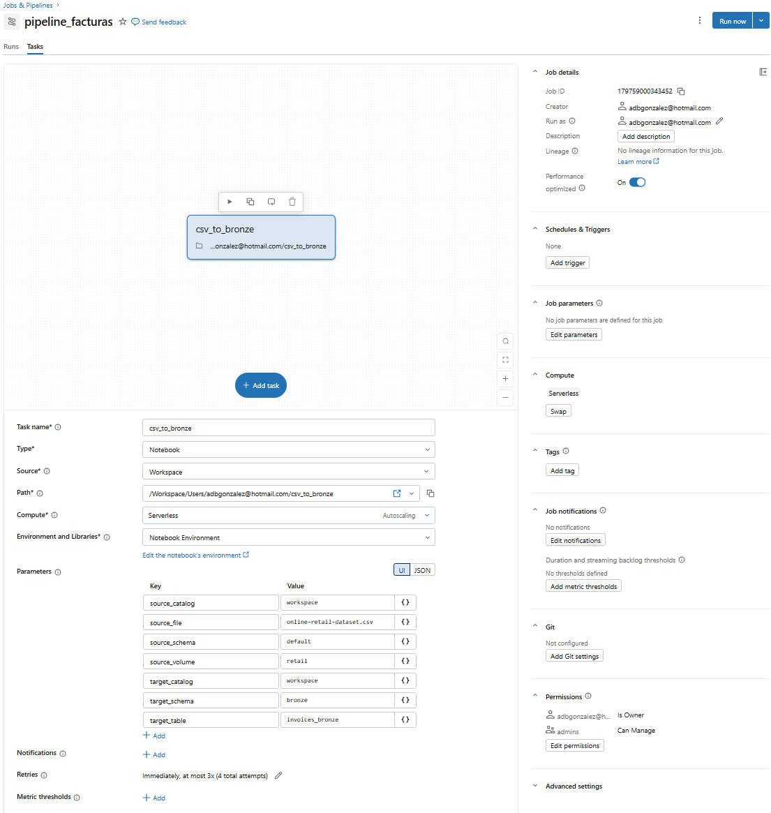
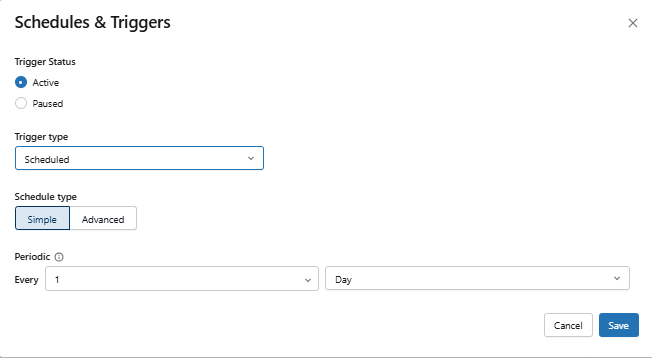
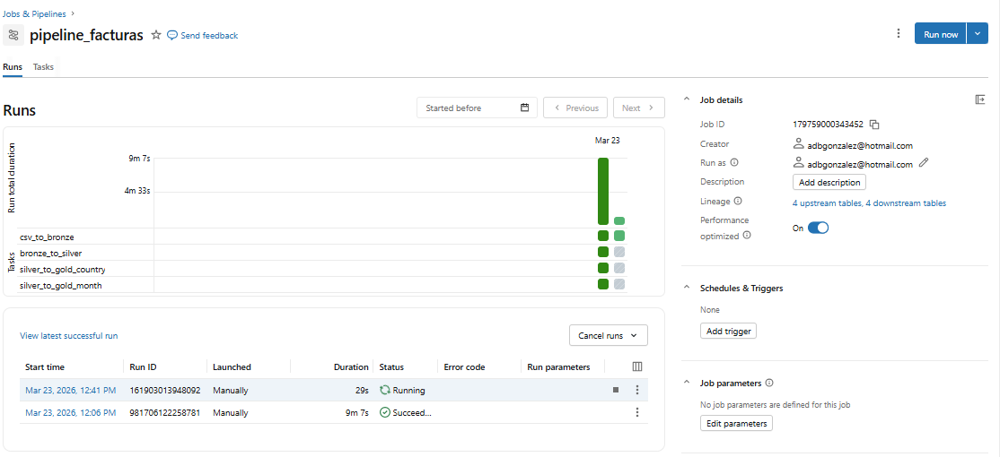
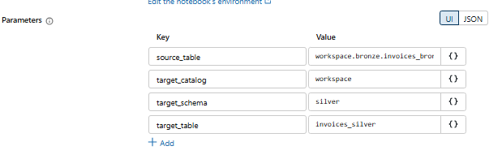
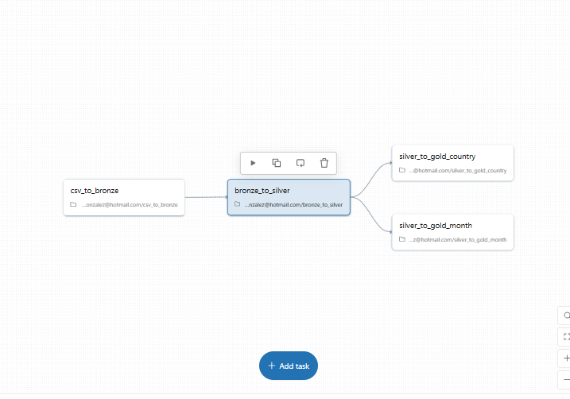
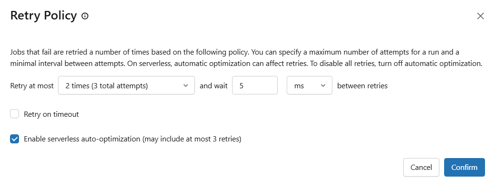
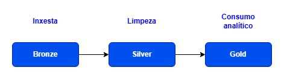
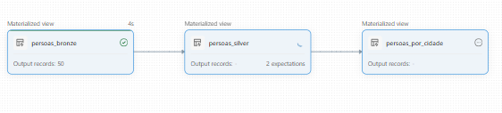
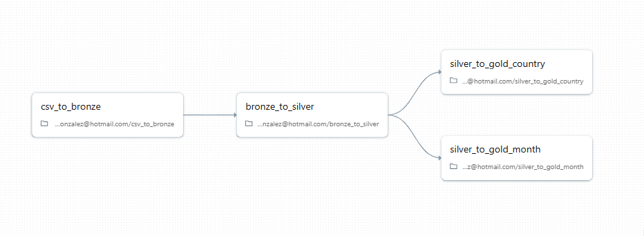
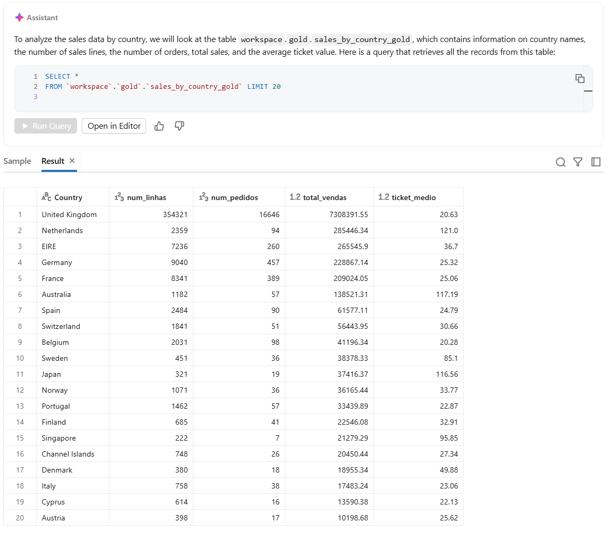

# 5. Orquestración de pipelines en Databricks

## 5.1 Que é Databricks Workflows

**Databricks Workflows** é a funcionalidade da plataforma que permite definir, executar e programar secuencias de tarefas.

O seu obxectivo principal é automatizar procesos como:

- execución de notebooks
- cargas e transformacións de datos
- actualización periódica de táboas
- execución encadeada de distintas etapas dun pipeline

Nun contexto de enxeñaría de datos, Workflows actúa como a capa de **orquestración** do sistema.

Isto significa que permite indicar:

- que tarefas hai que executar
- en que orde deben facelo
- con que parámetros
- con que frecuencia

Convén distinguir desde o principio entre dous conceptos próximos, pero non idénticos:

- un **pipeline** é o proceso de datos, é dicir, o conxunto de etapas polas que pasa a información
- un **workflow** é o mecanismo de orquestración que executa e coordina esas etapas

Noutras palabras, o pipeline describe a lóxica do proceso e o workflow encárgase de poñelo en marcha de forma ordenada e repetible.

---

## 5.2 Workflow, job e task

En Databricks aparecen varios conceptos relacionados entre si.

### Workflow

Un **workflow** é o conxunto global do proceso automatizado.

Representa a lóxica completa dun pipeline, incluíndo as súas tarefas e dependencias.

### Job

Na interface de Databricks, un workflow adoita materializarse como un **job**.

Un job é o obxecto que se configura, se executa manualmente ou se programa para executarse de forma automática.

### Task

Unha **task** é unha unidade de traballo dentro dun workflow.

Cada task pode realizar unha acción concreta, por exemplo:

- executar un notebook
- lanzar unha tarefa Python
- executar código SQL
- chamar a outro proceso

Un workflow pode ter unha única task ou varias tasks encadeadas.

---

## 5.3 Dependencias e fluxo de execución

As tarefas dun workflow poden executarse de forma independente ou depender unhas doutras.

Por exemplo:

1. unha primeira tarefa prepara os datos
2. unha segunda tarefa transforma a información
3. unha terceira tarefa garda o resultado final

Este tipo de relacións represéntase como un **DAG** (*directed acyclic graph*), é dicir, un grafo dirixido sen ciclos.

En Databricks, o DAG permite visualizar:

- a orde das tarefas
- que tarefas dependen doutras
- o estado de execución de cada parte do workflow

Este enfoque é moi útil para pipelines de datos, xa que facilita separar o proceso en etapas máis pequenas e controlables.

---

## 5.4 Creación dun workflow

Un workflow pódese crear desde a interface gráfica de Databricks, na sección **Workflows**.

De forma xeral, o proceso consiste en:

1. crear un novo job
2. darlle un nome descritivo
3. engadir unha primeira task
4. seleccionar o tipo de tarefa
5. indicar o notebook ou recurso que se vai executar
6. escoller o clúster de execución
7. engadir parámetros, se son necesarios
8. definir dependencias entre tasks, se hai máis dunha

As tarefas poden compartir o mesmo clúster ou executarse en clústeres distintos, segundo as necesidades do proceso.

En moitos casos, é recomendable empregar un **job cluster**, xa que se crea para a execución do workflow e se elimina automaticamente ao finalizar.


Figura 5.1. Creación dun workflow en Databricks.  
Fonte: elaboración propia.


---

## 5.5 Tipos habituais de tarefas

Dentro dun workflow, Databricks permite definir distintos tipos de tarefas.

As máis habituais en proxectos de datos son:

- **Notebook**: executa un notebook de Databricks
- **Python**: executa un script ou tarefa Python
- **SQL**: executa consultas ou procesos SQL
- **Spark Submit**: lanza unha aplicación Spark máis avanzada

A opción máis natural adoita ser traballar con tarefas de tipo **Notebook**, xa que permiten integrar código, explicacións e resultados nun mesmo recurso.

---

## 5.6 Programación e disparadores

Unha das principais vantaxes de Workflows é que permite executar procesos de forma automática.

Isto pódese facer mediante diferentes mecanismos:

- execución manual
- execución periódica segundo un horario
- execución continua
- execución ao detectar a chegada dun ficheiro

Por exemplo, un pipeline pode configurarse para executarse:

- cada día
- cada hora
- cada semana
- cando aparece un novo ficheiro nunha localización vixiada

Esta capacidade converte un notebook ou unha tarefa illada nun proceso operativo e reutilizable.


Figura 5.2. Programación dun workflow en Databricks.  
Fonte: elaboración propia.

---

## 5.7 Execución e monitorización

Unha vez creado, un workflow pode executarse e supervisarse desde a propia interface de Databricks.

O sistema permite consultar:

- execucións anteriores
- duración de cada run
- estado de cada task
- erros producidos durante a execución
- ligazóns a logs e métricas

Databricks ofrece habitualmente dúas vistas principais:

- **vista de matriz**, que mostra de forma visual as execucións e o estado das tarefas
- **vista de lista**, que mostra os runs de forma tabular

Isto facilita identificar:

- tarefas correctas
- tarefas fallidas
- tarefas omitidas
- execucións máis lentas do esperado


Figura 5.3. Seguimento de execucións dun workflow en Databricks.  
Fonte: elaboración propia.


---

## 5.8 Parámetros en Workflows

Os workflows poden recibir **parámetros**, o que permite reutilizar a mesma lóxica con valores distintos.

Por exemplo, un mesmo notebook pode executarse cambiando:

- o catálogo
- o esquema
- a táboa de destino
- a ruta dun ficheiro
- unha data de procesamento

Esta capacidade é especialmente útil cando se queren construír pipelines máis flexibles e reutilizables.

Pódense distinguir dous niveis:

- **parámetros de task**, válidos só para unha tarefa concreta
- **parámetros de job**, compartidos por distintas tarefas do workflow

Nun exemplo sinxelo, un workflow podería lanzar un notebook de carga con parámetros como estes:

```text
catalog = workspace
schema = bronze
input_file = /Volumes/workspace/default/retail/online-retail-dataset.csv
target_table = invoices_bronze
```

Estes parámetros poden ser lidos polo notebook mediante `dbutils.widgets`, tal como se viu no capítulo anterior, e empregados para construír rutas, nomes de táboas ou consultas SQL.

Por exemplo, un notebook parametrizado podería comezar así:

```python
dbutils.widgets.text("catalog", "workspace")
dbutils.widgets.text("schema", "bronze")
dbutils.widgets.text("input_file", "/Volumes/workspace/default/retail/online-retail-dataset.csv")
dbutils.widgets.text("target_table", "invoices_bronze")

catalog = dbutils.widgets.get("catalog")
schema = dbutils.widgets.get("schema")
input_file = dbutils.widgets.get("input_file")
target_table = dbutils.widgets.get("target_table")
```

Deste modo, o mesmo notebook pode reutilizarse en distintos workflows ou en distintos contextos sen cambiar o código principal.


Figura 5.4. Parámetros dunha task de notebook nun workflow de Databricks.  
Fonte: elaboración propia.


---

## 5.9 Parámetros e comunicación entre tarefas

Nun workflow real non abonda con executar tarefas illadas. Con frecuencia é necesario:

- pasar parámetros a unha task
- reutilizar o mesmo notebook con valores distintos
- compartir información dunha tarefa a outra

Dúas ideas especialmente útiles son:

- o uso de **widgets** para recibir parámetros nun notebook
- o uso de **task values** para compartir valores entre tarefas

Por exemplo, un notebook pode recibir parámetros como:

- catálogo
- esquema
- data de procesamento
- ruta dun ficheiro

En Databricks, isto permite construír workflows moito máis reutilizables, xa que o mesmo código pode executarse en distintos contextos sen ser reescrito.

Tamén é posible que unha tarefa deixe gardado un valor, por exemplo o nome dun volume ou a ruta dun ficheiro, para que outra tarefa o recupere máis adiante.

Este patrón é útil cando un workflow:

- crea recursos nunha primeira fase
- procesa os datos nunha segunda
- executa validacións ou limpeza nunha terceira

Un fluxo moi típico podería ser este:

1. unha primeira task recibe parámetros e prepara a ruta ou a táboa de entrada
2. unha segunda task executa a carga e garda un resultado intermedio
3. unha terceira task valida o resultado ou xera unha táboa agregada final

Nun enfoque introdutorio non é necesario entrar en todos os detalles técnicos de `task values`, pero si convén entender a idea xeral: un workflow non só executa tarefas en cadea, senón que tamén pode transmitir contexto entre elas.


Figura 5.5. Comunicación entre tarefas nun workflow de Databricks.  
Fonte: elaboración propia.


---

## 5.10 Xestión de erros, reintentos e alertas

Nun pipeline operativo non só importa que o proceso se execute, senón tamén saber que ocorre cando algo falla.

Databricks Workflows permite configurar distintos mecanismos de control:

- **retries**, para reintentar tarefas fallidas
- **notifications**, para recibir avisos por erro ou por outros eventos
- **duration thresholds**, para detectar execucións máis longas do esperado
- **repair** ou relanzamento parcial, en determinados escenarios

Isto resulta útil porque nun workflow poden aparecer problemas como:

- erros no código
- fallos ao acceder a datos
- ficheiros ausentes
- execucións máis lentas do previsto

Interesa especialmente comprender que un pipeline real debe ser:

- automatizable
- observable
- recuperable ante fallos

Por iso, ademais de definir tarefas e dependencias, convén pensar tamén en:

- que tarefas deben poder reintentarse
- que eventos deberían xerar unha notificación
- como identificar rapidamente en que paso fallou o proceso


Figura 5.6. Configuración da política de reintentos nunha task dun workflow de Databricks.  
Fonte: elaboración propia.

---

## 5.11 Relación con outras ferramentas de orquestración

Nunha arquitectura modular, a orquestración adoita realizarse con ferramentas específicas, como **Airflow**.

En Databricks, unha parte desta funcionalidade intégrase dentro da propia plataforma mediante Workflows.

Isto aporta vantaxes como:

- menor necesidade de integrar ferramentas externas
- execución máis próxima aos notebooks e aos datos
- configuración máis simple en contornos pequenos

Con todo, en contornos empresariais máis complexos pode seguir sendo habitual empregar ferramentas externas de orquestración.

---

## 5.12 Limitacións e consideracións prácticas

Non todas as funcionalidades de Workflows están sempre dispoñibles do mesmo modo en todos os plans ou contornos.

En determinados contornos e funcionalidades avanzadas pode ser necesario un workspace con **plan premium**.

Por tanto, convén ter presente que:

- algunhas opcións avanzadas poden non estar dispoñibles
- a interface pode variar lixeiramente
- determinados disparadores ou opcións de configuración poden depender do tipo de workspace

En calquera caso, os conceptos fundamentais seguen sendo os mesmos:

- definir tarefas
- establecer dependencias
- executar procesos
- programar runs
- supervisar resultados

---

## 5.13 Resumo

Databricks Workflows permite converter tarefas illadas en pipelines automatizados.

As ideas clave son:

- un workflow está formado por tarefas
- as tarefas poden depender unhas doutras
- a execución represéntase como un DAG
- os jobs poden programarse ou lanzarse manualmente
- os runs poden monitorizarse desde a interface
- os parámetros permiten reutilizar a mesma lóxica en distintos contextos

Este compoñente é a base da orquestración dentro de Databricks e completa o papel da plataforma como contorno integrado para o desenvolvemento de pipelines de datos.

---

## 5.14 Lakeflow Declarative Pipelines

Ademais de Workflows, Databricks ofrece unha forma declarativa de construír pipelines de datos. Tradicionalmente esta funcionalidade coñeceuse como **Delta Live Tables (DLT)**, pero na documentación máis recente aparece como **Lakeflow Declarative Pipelines (LDP)** ou, nalgúns contextos, **Lakeflow Spark Declarative Pipelines**.

Mentres que en Workflows o habitual é orquestrar tarefas como notebooks ou scripts, en Lakeflow Declarative Pipelines o foco está en declarar:

- as táboas de entrada
- as transformacións entre capas
- as dependencias entre conxuntos de datos
- as regras de calidade

Noutras palabras:

- **Workflows** orquestra tarefas
- **Lakeflow Declarative Pipelines** define o propio pipeline de datos

Neste capítulo seguirase mencionando tamén **Delta Live Tables** cando sexa útil, porque é un nome aínda moi estendido en materiais anteriores, pero convén saber que a denominación actual máis habitual na documentación oficial é **Lakeflow Declarative Pipelines (LDP)**.

Este enfoque encaixa especialmente ben en arquitecturas tipo:

- **bronze**: datos en bruto
- **silver**: datos limpos e transformados
- **gold**: datos preparados para análise


Figura 5.7. Esquema conceptual dun pipeline `bronze / silver / gold` en Databricks.  
Fonte: elaboración propia.

---

### 5.14.1 Abstraccións principais

Lakeflow Declarative Pipelines traballa principalmente con dous tipos de obxectos persistentes:

- **streaming tables**, pensadas para procesar datos incrementais a medida que van chegando
- **materialized views**, pensadas para manter o resultado actual dunha transformación ou agregación

En termos conceptuais:

- unha *streaming table* utilízase habitualmente nas capas máis próximas á inxestión
- unha táboa materializada resulta natural en capas máis agregadas ou orientadas ao consumo final

Isto explica ben por que Lakeflow Declarative Pipelines encaixa en pipelines de varias capas.

---

### 5.14.2 Procesamento declarativo

En Lakeflow Declarative Pipelines, o usuario non se centra tanto en escribir toda a lóxica de execución do pipeline, senón en declarar as transformacións.

Por exemplo, pódense definir:

- táboas de entrada mediante cargas incrementais
- táboas intermedias con limpeza e validación
- táboas finais con agregacións e enriquecementos

O sistema encárgase de aspectos como:

- inferencia de dependencias
- planificación da execución
- actualización das táboas
- seguimento do pipeline

---

### 5.14.3 Calidade de datos

Un dos puntos máis importantes deste enfoque é que Lakeflow Declarative Pipelines permite engadir **expectations**, é dicir, regras de calidade sobre os datos.

Estas expectativas permiten comprobar condicións como:

- que unha columna non sexa nula
- que unha clave sexa válida
- que non existan duplicados
- que unha referencia a outra táboa sexa correcta

Segundo a acción configurada, un rexistro que incumpre unha regra pode:

- xerar unha advertencia
- ser descartado
- facer fallar a actualización do pipeline

Este é un dos elementos que diferencian Lakeflow Declarative Pipelines dun conxunto de notebooks encadeados manualmente.

---

### 5.14.4 Relación con Workflows

Lakeflow Declarative Pipelines e Workflows non son excluíntes.

De feito, poden complementarse:

- **Lakeflow Declarative Pipelines** define a lóxica do pipeline de datos
- **Workflows** permite lanzar, programar e supervisar execucións dentro dun proceso máis amplo

Nun fluxo máis amplo, unha task dun workflow pode chegar a executar un pipeline do que tradicionalmente se coñecía como Delta Live Tables.

---

### 5.14.5 Consideración práctica

Lakeflow Declarative Pipelines é unha ferramenta máis avanzada ca un pipeline manual baseado só en notebooks.

Por iso, interesa principalmente entendela como:

- unha evolución natural dos pipelines manuais
- unha ferramenta especialmente útil para arquitecturas `bronze / silver / gold`
- unha solución que integra transformación, calidade e observabilidade

Interesa sobre todo comprendela a nivel conceptual. Non é necesario dominar toda a configuración de Lakeflow Declarative Pipelines para entender o seu papel dentro do ecosistema de Databricks.

Non se desenvolverá aquí en profundidade toda a súa configuración, pero é importante coñecer a idea xeral porque ocupa un papel central nos pipelines modernos en Databricks.

---

### 5.14.6 Exemplo sinxelo con `persoas.csv`

Un modo práctico de entender este enfoque consiste en construír un pipeline declarativo pequeno a partir do ficheiro `persoas.csv`.

Neste caso pódense definir tres saídas encadeadas:

- `persoas_bronze`, como lectura inicial do CSV
- `persoas_silver`, como versión limpa e validada
- `persoas_por_cidade`, como agregación final

Na interface de Databricks, o fluxo habitual consiste en:

1. crear un pipeline novo
2. seleccionar un catálogo e un esquema por defecto para o pipeline
3. engadir un ficheiro Python dentro de `transformations`
4. definir as transformacións con `@dp.materialized_view`
5. executar o pipeline co botón **Run**
6. revisar as dependencias co botón **Pipeline graph** do panel dereito

Mesmo así, nos exemplos resulta útil empregar o nome completo das táboas cando se le unha saída anterior, porque isto deixa máis explícito sobre que catálogo e esquema se está a traballar.

O exemplo podería escribirse así:

```python
from pyspark import pipelines as dp
from pyspark.sql import functions as F


CSV_PATH = "/Volumes/workspace/default/demo_ldp/persoas.csv"


@dp.materialized_view
def persoas_bronze():
    return (
        spark.read
        .option("header", "true")
        .option("inferSchema", "true")
        .csv(CSV_PATH)
    )


@dp.materialized_view
@dp.expect_or_drop("idade_valida", "idade IS NOT NULL AND idade >= 0")
@dp.expect_or_drop("nome_non_baleiro", "nome IS NOT NULL AND trim(nome) <> ''")
def persoas_silver():
    return (
        spark.read.table("workspace.demo_ldp.persoas_bronze")
        .withColumn("nome", F.initcap(F.trim(F.col("nome"))))
        .withColumn("cidade", F.initcap(F.trim(F.col("cidade"))))
        .withColumn("idade", F.col("idade").cast("int"))
    )


@dp.materialized_view
def persoas_por_cidade():
    return (
        spark.read.table("workspace.demo_ldp.persoas_silver")
        .groupBy("cidade")
        .agg(
            F.count("*").alias("total_persoas"),
            F.avg("idade").alias("idade_media")
        )
        .orderBy(F.col("total_persoas").desc(), F.col("cidade"))
    )
```

Neste exemplo:

- `persoas_bronze` le o ficheiro de entrada
- `persoas_silver` limpa e valida os rexistros
- `persoas_por_cidade` crea unha saída agregada lista para consulta

As regras `expect_or_drop` mostran tamén unha das vantaxes máis características deste enfoque: as comprobacións de calidade intégranse na propia definición do pipeline, sen necesidade de engadir unha fase separada de validación manual.

Despois de executar o pipeline, a interface pode mostrar o grafo de dependencias entre as tres saídas mediante o botón **Pipeline graph**.


Figura 5.8. Grafo de dependencias dun pipeline declarativo construído a partir de `persoas.csv`.  
Fonte: elaboración propia.

Este exemplo permite ver con claridade a diferenza co laboratorio anterior baseado en Workflows: aquí non se está a definir a orde de execución de notebooks independentes, senón a lóxica dun pipeline de datos no que as dependencias entre resultados se deducen a partir das transformacións declaradas.

O mesmo enfoque tamén podería expresarse en SQL, o que resulta especialmente cómodo en exemplos pequenos ou cando se quere poñer o foco nas transformacións sen entrar en detalles de PySpark. Unha versión equivalente podería ser esta:

```sql
CREATE OR REFRESH MATERIALIZED VIEW persoas_bronze
AS
SELECT *
FROM read_files(
  '/Volumes/workspace/default/demo_ldp/persoas.csv',
  format => 'csv',
  header => true
);

CREATE OR REFRESH MATERIALIZED VIEW persoas_silver
(
  CONSTRAINT idade_valida EXPECT (idade IS NOT NULL AND idade >= 0) ON VIOLATION DROP ROW,
  CONSTRAINT nome_non_baleiro EXPECT (nome IS NOT NULL AND trim(nome) <> '') ON VIOLATION DROP ROW
)
AS
SELECT
  initcap(trim(nome)) AS nome,
  cast(idade AS INT) AS idade,
  initcap(trim(cidade)) AS cidade
FROM workspace.demo_ldp.persoas_bronze;

CREATE OR REFRESH MATERIALIZED VIEW persoas_por_cidade
AS
SELECT
  cidade,
  count(*) AS total_persoas,
  avg(idade) AS idade_media
FROM workspace.demo_ldp.persoas_silver
GROUP BY cidade
ORDER BY total_persoas DESC, cidade;
```

En definitiva, tanto a versión en Python como a versión en SQL son dúas formas equivalentes de expresar o mesmo pipeline declarativo.

---

## 5.15 Laboratorio guiado: pipeline bronze, silver e gold

Esta práctica final propón un pequeno pipeline sobre un conxunto de datos de vendas, organizado en varias fases e pensado para executarse mediante notebooks parametrizados.

O obxectivo non é construír un sistema de produción completo, senón ver como se poden encadear transformacións reais en Databricks usando o modelo `bronze / silver / gold`.

O laboratorio baséase nos seguintes notebooks do cartafol `Databricks/notebooks`:

- [csv_to_bronze.ipynb](/c:/repo/bda/03.pipelines/Databricks/notebooks/csv_to_bronze.ipynb)
- [bronze_to_silver.ipynb](/c:/repo/bda/03.pipelines/Databricks/notebooks/bronze_to_silver.ipynb)
- [silver_to_gold_country.ipynb](/c:/repo/bda/03.pipelines/Databricks/notebooks/silver_to_gold_country.ipynb)
- [silver_to_gold_month.ipynb](/c:/repo/bda/03.pipelines/Databricks/notebooks/silver_to_gold_month.ipynb)

Este enfoque permite traballar cun laboratorio máis próximo a un caso real e, ao mesmo tempo, manter o capítulo máis limpo e lexible.

---

### 5.15.1 Obxectivo

Ao finalizar esta práctica, deberíase ser capaz de:

- cargar un ficheiro CSV nunha táboa da capa `bronze`
- transformar unha táboa da capa `bronze` nunha táboa máis limpa na capa `silver`
- xerar dúas saídas analíticas distintas na capa `gold`
- reutilizar notebooks parametrizados nun workflow
- comprender como unha mesma capa `silver` pode alimentar distintas saídas finais

---

### 5.15.2 Estrutura do laboratorio

O fluxo xeral proposto é este:

1. ler un ficheiro CSV desde un volume
2. cargar ese ficheiro nunha táboa `bronze`
3. executar un notebook `bronze_to_silver`
4. xerar unha táboa `gold` agregada por país
5. xerar unha táboa `gold` agregada por mes

En termos de saída, o pipeline produce:

- `workspace.bronze.invoices_bronze`
- `workspace.silver.invoices_silver`
- `workspace.gold.sales_by_country_gold`
- `workspace.gold.sales_by_month_gold`

---

### 5.15.3 Notebook 1. CSV a bronze

O primeiro notebook do laboratorio é [csv_to_bronze.ipynb](/c:/repo/bda/03.pipelines/Databricks/notebooks/csv_to_bronze.ipynb).

Este notebook encárgase de:

- recibir a ruta dun ficheiro CSV nun volume
- recibir tamén o catálogo, o esquema e o volume de orixe
- definir o esquema de lectura
- crear o esquema de destino da capa `bronze`
- ler o ficheiro coa configuración axeitada
- converter `InvoiceDate` a tipo timestamp
- engadir metadatos como `ingestion_timestamp`, `source_file` e `source_path`
- gardar o resultado como táboa Delta na capa `bronze`

Os parámetros principais son:

- `source_catalog`
- `source_schema`
- `source_volume`
- `source_file`
- `target_catalog`
- `target_schema`
- `target_table`

Por exemplo, a saída natural deste notebook sería `workspace.bronze.invoices_bronze`.

Este paso representa a entrada do pipeline e serve como base para o resto das transformacións.

---

### 5.15.4 Notebook 2. Bronze a silver

O segundo notebook do laboratorio é [bronze_to_silver.ipynb](/c:/repo/bda/03.pipelines/Databricks/notebooks/bronze_to_silver.ipynb).

Este notebook:

- recibe como entrada a táboa `bronze`
- limpa rexistros con valores nulos en campos clave
- elimina cantidades e prezos incorrectos
- normaliza algúns campos de texto
- calcula a columna derivada `total_price`
- escribe o resultado na capa `silver`

Os parámetros principais son:

- `source_table`
- `target_catalog`
- `target_schema`
- `target_table`

Este notebook está pensado para ser reutilizable, tanto manualmente como dentro dun workflow.

---

### 5.15.5 Notebook 3. Silver a gold por país

O terceiro notebook é [silver_to_gold_country.ipynb](/c:/repo/bda/03.pipelines/Databricks/notebooks/silver_to_gold_country.ipynb).

Neste caso, a táboa `silver` utilízase para crear unha saída agregada por país.

O notebook calcula, entre outros elementos:

- número de liñas
- número de pedidos
- total de vendas
- ticket medio

O resultado escríbese como táboa `gold`, por defecto `workspace.gold.sales_by_country_gold`.

Esta saída é útil para responder preguntas analíticas sinxelas, como que países concentran máis volume de vendas.

---

### 5.15.6 Notebook 4. Silver a gold por mes

O cuarto notebook é [silver_to_gold_month.ipynb](/c:/repo/bda/03.pipelines/Databricks/notebooks/silver_to_gold_month.ipynb).

Neste caso, a táboa `silver` agrégase por mes a partir da columna `InvoiceDate`.

O notebook calcula:

- número de pedidos por mes
- número de clientes distintos
- total de vendas mensual

O resultado escríbese como táboa `gold`, por defecto `workspace.gold.sales_by_month_gold`.

Esta variante permite ver que unha mesma capa `silver` pode dar lugar a distintas saídas finais, segundo a necesidade analítica.

---

### 5.15.7 Orde de execución

Nunha execución manual, a orde recomendada sería:

1. executar `csv_to_bronze.ipynb`
2. executar `bronze_to_silver.ipynb`
3. executar `silver_to_gold_country.ipynb`
4. executar `silver_to_gold_month.ipynb`

Nun workflow, a dependencia máis natural sería esta:

- unha task inicial `csv_to_bronze`
- unha task `bronze_to_silver` dependente da anterior
- unha task `silver_to_gold_country` dependente de `bronze_to_silver`
- unha task `silver_to_gold_month` dependente de `bronze_to_silver`

É importante remarcar que **non existe dependencia entre os dous notebooks `gold`**. Os dous parten da mesma saída `silver`, pero xeran produtos analíticos distintos e poden executarse en paralelo.

Este enfoque mostra ben que unha mesma saída `silver` pode alimentar varias ramas do pipeline.


Figura 5.9. Dependencias entre tarefas no workflow do laboratorio `bronze / silver / gold`.  
Fonte: elaboración propia.

---

### 5.15.8 Interpretación do resultado

Ao finalizar o laboratorio, as capas cumpren funcións distintas:

- **bronze** incorpora o dato de entrada desde o CSV á estrutura tabular do pipeline
- **silver** concentra a limpeza, normalización e enriquecemento básico
- **gold** ofrece táboas xa preparadas para análise

Neste exemplo, a capa `gold` non é única, senón que se desdobra en dúas saídas:

- unha orientada a análise xeográfica
- outra orientada a análise temporal

Neste punto resulta especialmente útil incorporar unha captura dunha das táboas `gold`, preferiblemente a saída por país, xa que adoita ser a máis fácil de interpretar visualmente.


Figura 5.10. Exemplo de saída `gold` agregada por país.  
Fonte: elaboración propia.

Este patrón é moi habitual en pipelines reais.

---

### 5.15.9 Relación con Workflows e Lakeflow Declarative Pipelines

Este laboratorio está deseñado para funcionar moi ben con **Workflows**, porque cada notebook pode converterse nunha task parametrizada.

Un deseño moi natural sería:

- unha task `csv_to_bronze`
- unha task `bronze_to_silver`
- unha task `silver_to_gold_country`
- unha task `silver_to_gold_month`

Coa task `bronze_to_silver` dependendo de `csv_to_bronze`, e coas dúas tasks `gold` dependendo de `bronze_to_silver`.

De novo, convén deixar claro que `silver_to_gold_country` e `silver_to_gold_month` non dependen unha da outra. As dúas comparten a mesma entrada `silver`, pero producen saídas diferentes.

Desde un punto de vista conceptual, o mesmo laboratorio tamén permite entender por que Lakeflow Declarative Pipelines resulta útil: as dependencias entre capas e saídas finais xa están bastante claras e poden expresarse de forma máis declarativa nun enfoque máis avanzado.

---
