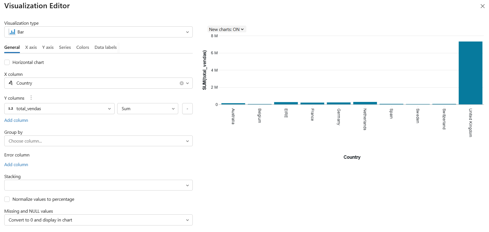
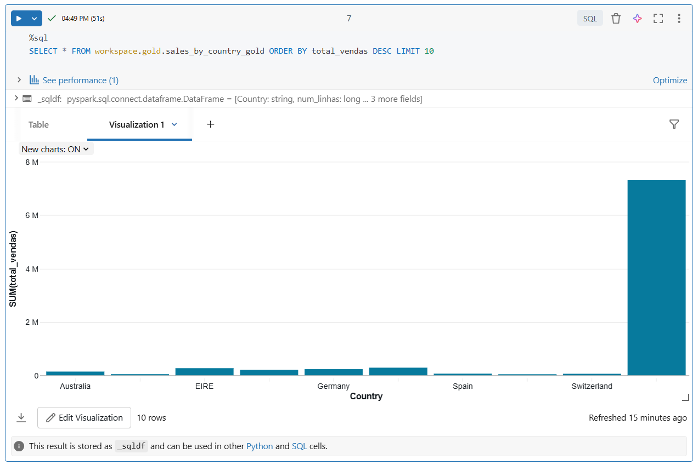
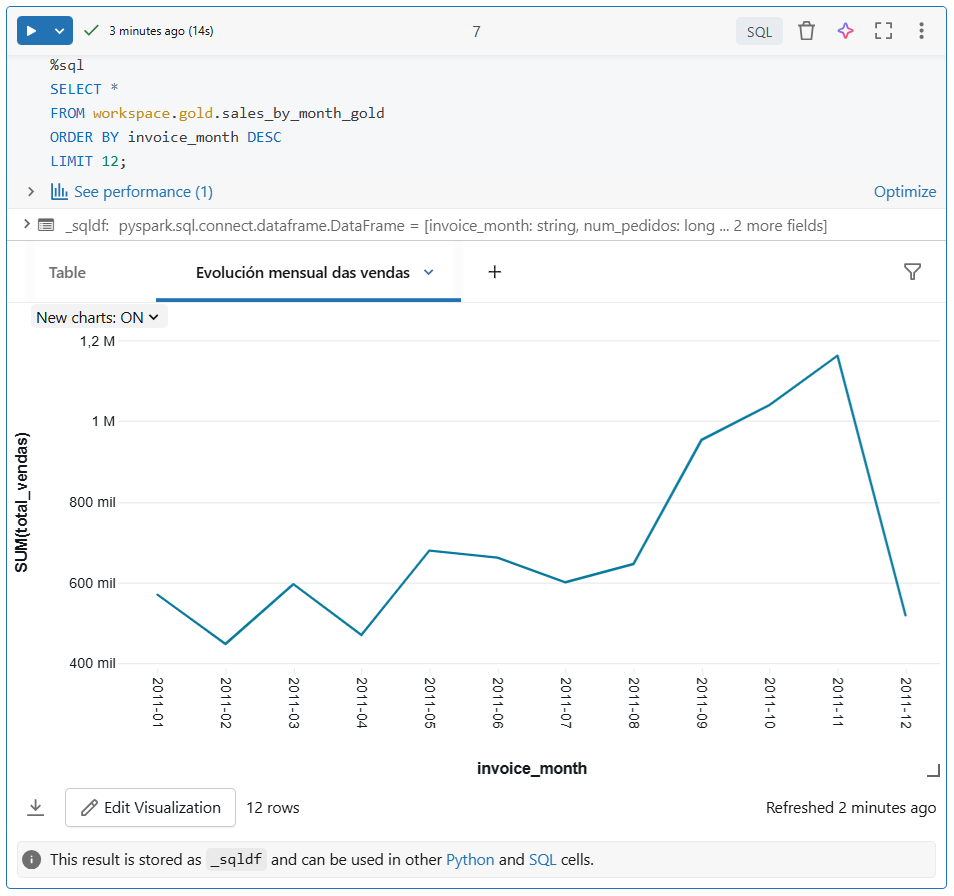
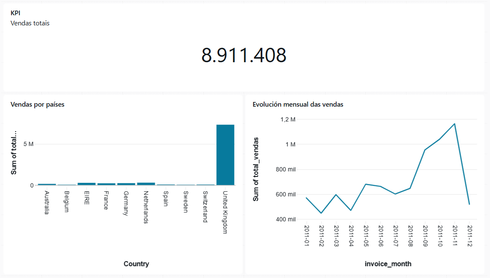

# 6. Visualizacións e dashboards en Databricks

## 6.1 O papel das visualizacións en Databricks

Despois de cargar, transformar e orquestrar datos, o seguinte paso natural é representar os resultados de forma clara.

En Databricks, as visualizacións permiten:

- explorar rapidamente os datos
- comprobar se as transformacións produciron o resultado esperado
- comunicar conclusións de forma máis intuitiva
- construír saídas máis útiles para análise e seguimento

A visualización non é un elemento separado do pipeline, senón unha capa final de explotación dos datos xa preparados.

---

## 6.2 Visualizacións dentro dun notebook

Databricks permite crear visualizacións directamente a partir do resultado dunha consulta SQL ou dunha táboa mostrada nun notebook.

Isto resulta útil porque permite:

- probar consultas e ver resultados no mesmo contorno
- comparar rapidamente distintos tipos de gráfico
- validar táboas `silver` ou `gold`
- preparar análises simples sen saír do notebook

O fluxo habitual adoita ser este:

1. executar unha consulta ou transformación
2. amosar un resultado tabular
3. cambiar a representación a un gráfico
4. axustar eixes, agregacións e categorías

---

## 6.3 Como crear unha visualización nun notebook

Un modo habitual de crear unha visualización en Databricks consiste en partir dunha consulta SQL ou dunha táboa xa cargada.

De forma xeral, o proceso adoita ser este:

1. executar unha consulta ou unha cela que devolva un resultado tabular
2. amosar o resultado no notebook
3. premer en `+`
4. escoller a opción `Visualization`
5. abrir o panel de configuración da visualización
6. escoller o tipo de gráfico
7. indicar que columnas se usarán como categorías, series ou valores
8. gardar a configuración da visualización

Na configuración da visualización, os parámetros principais que adoitan cubrirse son:

- o **tipo de gráfico**
- a columna do **eixe X**
- a columna ou columnas do **eixe Y**
- a **serie** ou agrupación, se existe
- a **orde** dos valores
- o **título** da visualización
- o formato de números, datas ou etiquetas, se procede

Segundo o tipo de gráfico, estes campos poden aparecer con nomes lixeiramente distintos, pero a lóxica xeral é a mesma: indicar que dimensión se quere representar e que medida se quere visualizar.


Figura 6.1. Creación dunha visualización nun notebook de Databricks.  
Fonte: elaboración propia.

Por exemplo, unha consulta como esta:

```sql
%sql
SELECT Country, total_vendas
FROM workspace.gold.sales_by_country_gold
ORDER BY total_vendas DESC
LIMIT 10
```

pode representarse como un gráfico de barras, usando:

- `Country` como categoría
- `total_vendas` como valor
- orde descendente por `total_vendas`
- título `Vendas por país`

Nunha serie temporal, o proceso sería similar, pero empregando unha columna temporal no eixe horizontal.

Ao crear a visualización, convén revisar:

- a orde das categorías
- o formato dos valores
- a presenza de etiquetas claras
- se o gráfico resume ben a pregunta que se quere responder

---

## 6.4 Tipos básicos de gráfico

Databricks ofrece varios tipos de representación visual.

Os máis útiles adoitan ser os seguintes:

- **Táboa**. É a representación máis simple e segue sendo unha das máis importantes. Resulta útil cando interesa revisar valores exactos, comprobar rexistros concretos ou validar o resultado dunha transformación antes de pasar a unha representación máis visual.
- **Barras**. É unha das mellores opcións para comparar categorías. Por exemplo, permite ver con claridade que países venden máis, que produtos teñen máis pedidos ou que categorías concentran máis importe.
- **Liñas**. Resultan especialmente adecuadas para datos temporais. Permiten observar evolucións, tendencias e cambios ao longo do tempo, por exemplo vendas por mes ou número de pedidos por semana.
- **Áreas**. Son semellantes aos gráficos de liñas, pero enfatizan máis o volume acumulado. Poden ser útiles cando interesa destacar o peso dunha serie ao longo do tempo e non só a súa evolución.
- **Sectores**. Serven para representar composicións simples, é dicir, como se reparte un total entre poucas categorías. Con todo, adoitan perder claridade cando hai demasiados segmentos ou cando as diferenzas son pequenas.
- **Dispersión**. Útil para analizar a relación entre dúas variables numéricas. Por exemplo, podería empregarse para observar se existe relación entre número de pedidos e importe total, ou entre cantidade e prezo unitario.

Barras, liñas e táboas adoitan ser as representacións máis frecuentes e máis fáciles de interpretar.

Non todos os gráficos serven para calquera situación.

Por iso convén relacionar cada tipo de visualización co tipo de pregunta que se quere responder.

---

## 6.5 Escoller o gráfico axeitado

Despois de coñecer os tipos básicos de gráfico, o seguinte paso consiste en escoller a representación máis adecuada para cada caso.

Por exemplo:

- se se queren comparar categorías, adoita ser mellor un gráfico de barras
- se se quere observar unha evolución temporal dunha variable numérica, adoita ser mellor un gráfico de liñas
- se se quere representar unha composición simple entre poucas categorías, pode empregarse un gráfico de sectores
- se se quere analizar a relación entre dúas variables numéricas, resulta máis axeitado un gráfico de dispersión
- se se queren revisar valores exactos ou detalle rexistro a rexistro, a táboa segue sendo a mellor opción

Unha mala elección visual pode dificultar a interpretación mesmo cando os datos son correctos.

---

## 6.6 Visualizacións a partir de táboas `gold`

As táboas `gold` son especialmente adecuadas para visualización, porque xa conteñen datos limpos, agregados e orientados ao consumo.

Isto fai que encaixen moi ben con gráficos como:

- vendas por país
- vendas por mes
- ranking de categorías
- evolución de clientes ou pedidos

Conectar esta idea co capítulo anterior é importante:

- `bronze` conserva datos máis próximos á entrada
- `silver` limpa e normaliza
- `gold` prepara saídas máis útiles para análise e visualización

---

## 6.7 Dashboards en Databricks

Ademais das visualizacións dentro dos notebooks, Databricks permite organizar resultados en **dashboards**.

Un dashboard permite reunir nun mesmo espazo:

- varias visualizacións
- táboas resumo
- filtros ou parámetros, segundo o caso
- indicadores relevantes para seguimento

O dashboard pode entenderse como un paso adicional:

- o notebook serve para construír e validar
- o dashboard serve para presentar e seguir resultados

Ao gardar unha visualización, Databricks adoita permitir dúas opcións:

- engadila a un **dashboard independente**
- engadila ao **notebook dashboard**

A diferenza principal está en onde queda integrada a visualización:

- un **dashboard independente** funciona como panel separado do notebook e resulta máis axeitado para reunir varias visualizacións nun espazo final de consulta ou presentación
- un **notebook dashboard** queda asociado ao propio notebook no que se creou a visualización e mantén a presentación máis ligada a ese recurso

---

## 6.8 Como crear un dashboard

Un dashboard constrúese reunindo varias visualizacións nun mesmo espazo.

De forma xeral, o proceso adoita ser este:

1. crear previamente unha ou varias visualizacións a partir de consultas ou táboas
2. abrir a opción para engadir esa visualización a un dashboard
3. escoller se se quere engadir a un dashboard independente ou ao notebook dashboard
4. crear un dashboard novo ou engadila a un xa existente
5. organizar os elementos no panel
6. gardar o resultado e revisar a súa lexibilidade

Nun exemplo sinxelo, un dashboard podería combinar:

- unha barra de vendas por país
- unha liña coa evolución mensual
- un KPI de resumo
- ou, se a interface o permite, unha táboa complementaria

Ao construír un dashboard convén pensar en:

- que visualización vai primeiro
- que lectura se quere facilitar
- se hai elementos redundantes
- se o panel se entende rapidamente sen explicación adicional

---

## 6.9 Boas prácticas de visualización

Ao traballar con gráficos e dashboards convén seguir algunhas recomendacións simples:

- empregar títulos claros
- indicar ben o que representan os eixes
- evitar gráficos innecesariamente recargados
- limitar o número de categorías cando a visualización o requira
- ordenar correctamente barras e series temporais
- partir, sempre que sexa posible, de táboas xa limpas e agregadas

Estas boas prácticas non son exclusivas de Databricks, pero resultan especialmente importantes cando se queren comunicar resultados a outras persoas.

---

## 6.10 Limitacións e consideracións prácticas

As opcións de visualización dispoñibles poden variar segundo:

- o tipo de notebook
- a forma en que se executa a consulta
- a interface concreta do contorno
- as capacidades dispoñibles no workspace

Por iso, neste bloque interesa máis entender:

- que tipos de visualización son máis útiles
- cando convén empregar notebook e cando dashboard
- por que a capa `gold` é a máis adecuada para explotación visual

---

## 6.11 Laboratorio guiado: das táboas `gold` ao dashboard

Como práctica final, este capítulo pode propoñer un pequeno laboratorio no que se parta das táboas creadas no capítulo 5:

- `workspace.gold.sales_by_country_gold`
- `workspace.gold.sales_by_month_gold`

O obxectivo sería:

1. abrir as táboas `gold`
2. crear unha visualización por país
3. crear unha visualización temporal por mes
4. comparar distintos tipos de gráfico
5. reunir os resultados nun pequeno dashboard

Neste laboratorio tomarase a opción de engadir as visualizacións a un **dashboard independente**.

### 6.11.1 Visualización 1. Vendas por país

A primeira visualización pode construírse a partir da táboa:

`workspace.gold.sales_by_country_gold`

Neste caso, a opción máis natural adoita ser un **gráfico de barras**, porque permite comparar categorías de forma clara.

Os pasos habituais serían:

1. abrir unha consulta sobre `workspace.gold.sales_by_country_gold`, ordenando descendentemente por `total_vendas` e limitando o resultado a 10 países
2. amosar o resultado tabular
3. premer en `+`
4. escoller `Visualization`
5. seleccionar un gráfico de tipo `Bar`

Unha configuración razonable sería esta:

- **tipo de gráfico**: `Bar`
- **eixe X**: `Country`
- **eixe Y**: `total_vendas`
- **orde**: descendente por `total_vendas`
- **título**: `Vendas por país`

Se se quere enriquecer a visualización, tamén se poden revisar columnas como:

- `num_pedidos`
- `ticket_medio`

pero para unha primeira representación adoita ser mellor comezar cunha única medida principal.


Figura 6.2. Visualización de vendas por país nun notebook de Databricks.  
Fonte: elaboración propia.


### 6.11.2 Visualización 2. Evolución mensual das vendas

A segunda visualización pode construírse a partir da táboa:

`workspace.gold.sales_by_month_gold`

Aquí a representación máis natural adoita ser un **gráfico de liñas**, xa que a variable principal está organizada no tempo.

Os pasos serían semellantes:

1. abrir unha consulta sobre `workspace.gold.sales_by_month_gold`
2. amosar o resultado
3. premer en `+`
4. escoller `Visualization`
5. seleccionar un gráfico de tipo `Line`

Unha configuración típica sería:

- **tipo de gráfico**: `Line`
- **eixe X**: `invoice_month`
- **eixe Y**: `total_vendas`
- **orde**: ascendente por `invoice_month`
- **título**: `Evolución mensual das vendas`

De forma opcional, tamén se poderían explorar outras medidas da mesma táboa, como:

- `num_pedidos`
- `num_clientes`

Isto permitiría comparar distintas lecturas do comportamento mensual.


Figura 6.3. Evolución mensual das vendas nun notebook de Databricks.  
Fonte: elaboración propia.

### 6.11.3 Creación do dashboard final

Unha vez creadas as dúas visualizacións, o seguinte paso consiste en incorporalas a un dashboard.

O proceso máis habitual sería:

1. abrir cada visualización xa gardada
2. escoller a opción para engadila a un dashboard independente
3. crear un dashboard novo
4. colocar primeiro a gráfica por país
5. colocar despois a gráfica temporal por mes
6. revisar o tamaño e a disposición dos paneis

Nun deseño sinxelo, o dashboard podería incluír:

- unha barra de vendas por país
- unha liña de evolución mensual
- opcionalmente, un KPI de resumo mediante un gráfico de tipo `Counter`
- opcionalmente, unha táboa de apoio baseada na capa `silver`

O KPI pode empregarse para destacar unha métrica única e fácil de interpretar, por exemplo:

- total de vendas
- número total de pedidos
- número de clientes distintos
- ticket medio

Para iso, o habitual é partir dunha consulta que devolva un único valor e representala cunha visualización de tipo `Counter`.

Por exemplo:

```sql
%sql
SELECT ROUND(SUM(total_vendas), 2) AS total_vendas_global
FROM workspace.gold.sales_by_month_gold
```

Ademais, pode resultar útil crear unha táboa de apoio a partir de `workspace.silver.invoices_silver`, por exemplo para:

- revisar unha mostra de rexistros xa limpos
- mostrar algunhas columnas relevantes do proceso intermedio
- conectar o dashboard final co dato transformado antes da agregación `gold`

Na práctica, esta táboa pode non ofrecer a opción de engadirse a un dashboard independente e quedar limitada ao **notebook dashboard**. Nese caso, pódese manter como complemento dentro do notebook ou dentro do seu panel asociado, mentres que o dashboard independente queda reservado para as visualizacións principais.

Un exemplo sinxelo de consulta para esa táboa podería ser:

```sql
%sql
SELECT InvoiceNo, InvoiceDate, CustomerID, Country, total_price
FROM workspace.silver.invoices_silver
ORDER BY InvoiceDate DESC
LIMIT 20
```

Ao rematar, convén comprobar:

- se os títulos son claros
- se os eixes están ben identificados
- se as visualizacións se entenden sen explicación adicional
- se o panel ofrece unha lectura rápida do resultado final do pipeline


Figura 6.4. Dashboard final construído a partir das táboas `gold`.  
Fonte: elaboración propia.


Este laboratorio permitiría pechar o fluxo completo:

- carga e transformación de datos
- orquestración do pipeline
- preparación da capa `gold`
- explotación visual dos resultados

---

## 6.12 Relación co seguinte capítulo

Unha vez vistas as visualizacións, o seguinte paso natural é abordar como organizar mellor o desenvolvemento e mantemento deste tipo de artefactos nun contorno real.

Isto conecta co seguinte bloque, dedicado a prácticas de **DevOps** e traballo colaborativo en Databricks, incluíndo aspectos como:

- versionado
- integración con Git
- organización de notebooks e código
- promoción entre contornos
- automatización do ciclo de desenvolvemento

---
