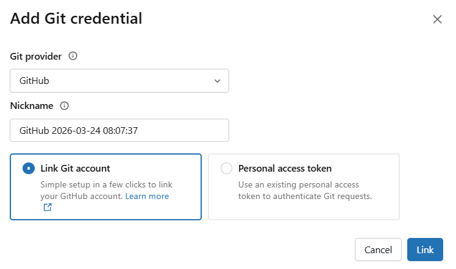
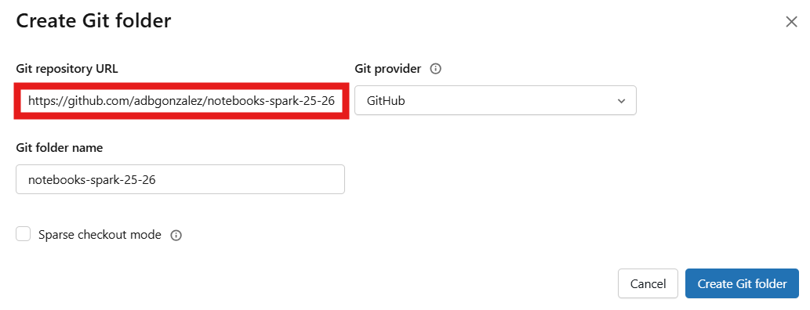
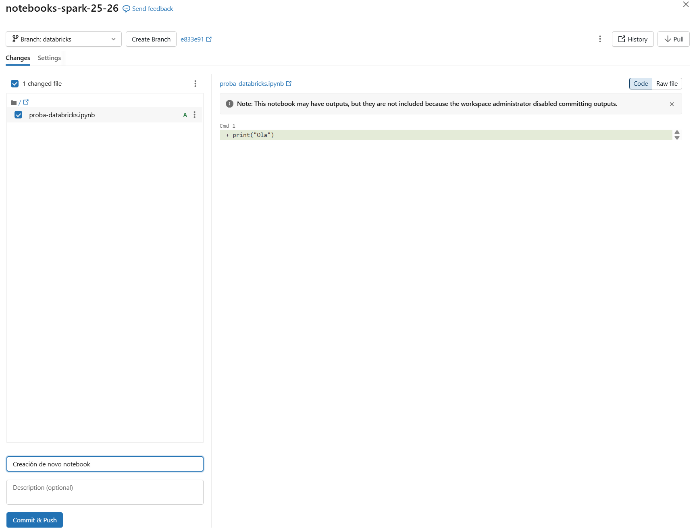
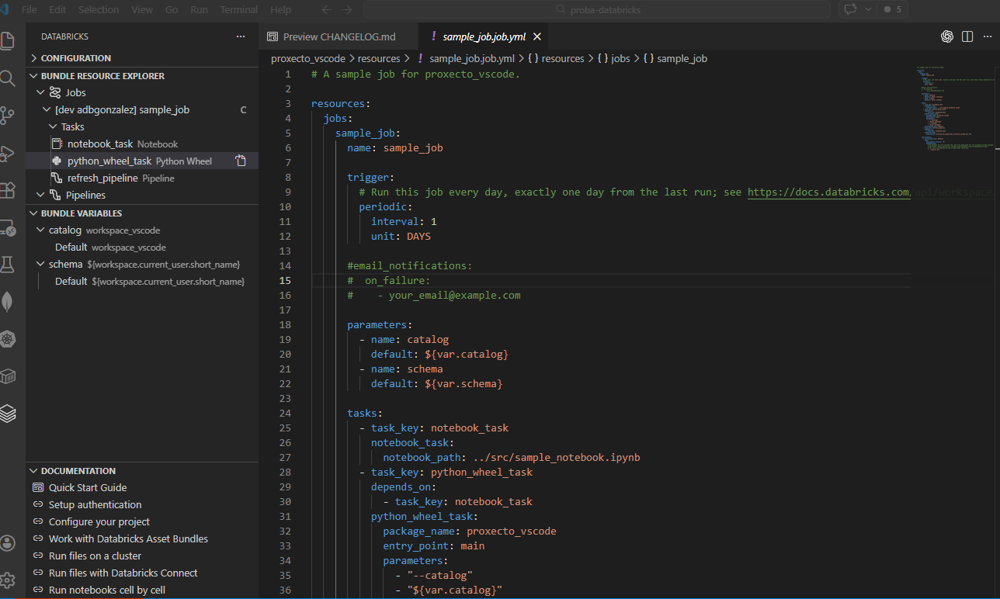
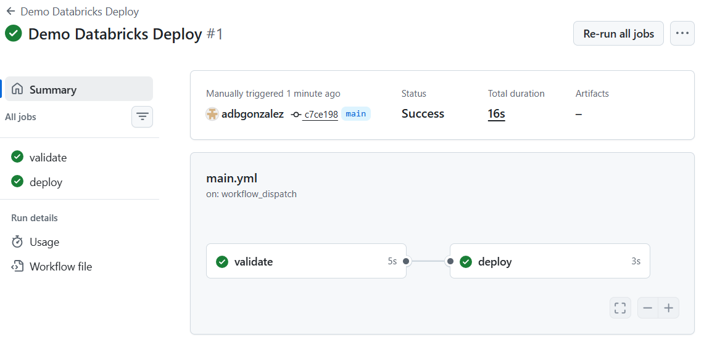

# 7. DataOps e DevOps en Databricks

## 7.1 Que son DataOps e DevOps

**DataOps** e **DevOps** son dous enfoques que buscan mellorar a calidade, a velocidade e a fiabilidade dos procesos técnicos.

No ámbito dos datos, adoitan estar moi relacionados, pero non significan exactamente o mesmo:

- **DataOps** céntrase na construción, automatización e seguimento do ciclo de vida dos datos
- **DevOps** céntrase na integración, entrega e mantemento continuo do código e das aplicacións

Nunha plataforma como Databricks, ambos enfoques conflúen con frecuencia, porque o traballo diario combina:

- notebooks
- scripts
- workflows
- pipelines
- configuración de contornos
- integración con Git
- despregues entre distintos ambientes

Por iso, ao falar de DataOps e DevOps en Databricks, o máis importante non é facer unha separación ríxida, senón entender que se trata de traballar de forma máis ordenada, reproducible e colaborativa.

---

## 7.2 Por que son importantes en Databricks

Nun proxecto pequeno pode parecer suficiente con editar notebooks directamente no workspace e executalos manualmente.

Con todo, cando o traballo medra, aparecen necesidades como estas:

- controlar os cambios no código
- saber quen modificou cada parte
- probar cambios sen afectar o entorno principal
- separar desenvolvemento e produción
- automatizar despregues
- reducir erros manuais

Databricks ofrece varias ferramentas que permiten cubrir estas necesidades sen saír da propia plataforma ou combinándoa con ferramentas externas.

---

## 7.3 Git folders, Repos e integración con Git

Un dos primeiros pasos cara a un fluxo máis profesional consiste en integrar Databricks con **Git**.

Databricks inclúe a funcionalidade coñecida tradicionalmente como **Repos** e identificada en interfaces máis recentes como **Git folders**. Esta funcionalidade permite conectar o workspace cun repositorio remoto, por exemplo en:

- GitHub
- GitLab
- Bitbucket
- Azure DevOps

Antes de clonar ou conectar un repositorio, normalmente cómpre configurar a integración co provedor Git nas preferencias do usuario. Nunha interface habitual, este paso faise en `User settings -> Linked accounts -> Git integration`, onde se introducen as credenciais ou o token correspondente.

Aí preséntase un cadro de diálogo no que se elixe o provedor Git e, en función de cal elixamos, haberá que introducir un **personal access token** ou autorizar a ligazón coa conta correspondente. No caso de **GitHub**, tamén pode ser necesario instalar a aplicación de Databricks na conta para que o repositorio se poida clonar e xestionar desde o workspace.

Figura 7.1. Enlazar conta de GitHub co workspace de Databricks.  
Fonte: elaboración propia.

Isto permite:

- clonar un repositorio dentro de Databricks
- editar notebooks e ficheiros ligados a Git
- facer `commit` e `push` desde a interface
- facer `pull` dos cambios remotos
- traballar con ramas

Desde o punto de vista práctico, os Git folders ou Repos fan posible que os notebooks e outros ficheiros non vivan só dentro do workspace, senón tamén dentro dun sistema de control de versións.

Para crear un Git folder ou Repo, a forma recomendada hoxe en día é situarse no cartafol onde se quere crear, facer clic en "Create" e elixir a opción de Git folder ou Repo. A continuación, indicarase a URL do repositorio remoto e, se é necesario, as credenciais para acceder a el.

> Nota: No workspace hai un directorio específico para os *Git folders* chamado `Repos`, pero non é necesario crealos aí, xa que responde máis ben a unha organización histórica da interface.

Figura 7.2. Creación dun repositorio Git en Databricks Git folders ou Repos.  
Fonte: elaboración propia.

---

## 7.4 Fluxo básico con Git folders ou Repos

Un fluxo típico con Git folders ou Repos adoita ser este:

1. crear ou escoller un repositorio remoto
2. configurar as credenciais e a integración Git no usuario
3. clonar o repo no workspace
4. editar notebooks ou ficheiros dentro do repo
5. facer `commit` e `push`
6. traer cambios con `pull`
7. traballar con ramas para desenvolvemento paralelo

Este modelo permite un traballo máis próximo ao habitual en proxectos de software e facilita a colaboración entre varias persoas.

Figura 7.3. Xestión de cambios e ramas en Databricks Git folders ou Repos.  
Fonte: elaboración propia.

---

## 7.5 Databricks CLI

Ademais da interface gráfica, Databricks ofrece unha **CLI** (*command-line interface*) que permite automatizar moitas operacións desde terminal.

Isto resulta útil para:

- crear e borrar clusters
- lanzar e xestionar jobs
- importar e exportar ficheiros
- integrar Databricks en scripts
- preparar automatizacións e despregues

Para unha primeira toma de contacto, o máis práctico é seguir directamente o titorial oficial da documentación de Databricks para Windows, que explica a instalación, a configuración e a autenticación paso a paso:

<https://docs.databricks.com/aws/en/dev-tools/cli/tutorial?language=Windows>

Este enfoque é especialmente importante cando se quere pasar dun uso manual da plataforma a un uso máis automatizado, pero non é necesario desenvolver aquí todos os detalles de instalación porque poden cambiar co tempo e dependen tamén do sistema operativo.

---

## 7.6 Desenvolvemento local con VS Code

Outra peza importante do fluxo DevOps consiste en poder traballar fóra da interface web de Databricks.

A extensión de Databricks para **Visual Studio Code** permite:

- editar ficheiros localmente
- sincronizar código co workspace
- probar notebooks e scripts nun entorno máis próximo ao desenvolvemento tradicional
- combinar mellor o traballo local con Git

Este tipo de fluxo resulta útil cando o proxecto inclúe:

- varios ficheiros
- módulos Python
- configuración declarativa
- probas locais

Segundo a documentación oficial, para usar esta extensión cómpre ter polo menos un **workspace** dispoñible, un **cluster** no que executar código e unha versión recente de **Visual Studio Code**. A extensión non está pensada para traballar sobre **Databricks SQL warehouses**.

O fluxo básico de configuración adoita ser este:

1. instalar a extensión oficial de **Databricks** desde o marketplace de Visual Studio Code
2. abrir Visual Studio Code e acceder á vista lateral de Databricks
3. crear un proxecto novo ou configurar o cartafol actual para usalo coa extensión
4. indicar o **Databricks host**, que é a URL base do workspace, por exemplo `https://...databricks...`
5. escoller un método de autenticación, normalmente **OAuth** se está dispoñible, ou ben **PAT** se o contorno traballa con *personal access tokens*
6. seleccionar o workspace e, cando sexa necesario, o cluster co que se vai traballar

Unha vez feita a conexión, pódense usar varios fluxos:

- executar ficheiros `.py` directamente nun cluster
- lanzar ficheiros ou notebooks como **jobs** en Databricks
- traballar con proxectos baseados en **Databricks Asset Bundles**
- apoiar tarefas de depuración mediante **Databricks Connect**, cando o escenario o requira

Desde o punto de vista práctico, o `host` que pide VS Code non é máis ca a URL principal do workspace de Databricks. É dicir, a parte inicial que aparece na barra do navegador, sen rutas adicionais como `/workspace` nin parámetros finais.

Para unha guía paso a paso actualizada, convén apoiar esta sección na documentación oficial:

- instalación da extensión: <https://docs.databricks.com/aws/en/dev-tools/vscode-ext/install>
- visión xeral da extensión: <https://docs.databricks.com/aws/en/dev-tools/vscode-ext/>
- execución de ficheiros e notebooks desde VS Code: <https://docs.databricks.com/en/dev-tools/vscode-ext/run.html>
- depuración con Databricks Connect: <https://docs.databricks.com/aws/en/dev-tools/vscode-ext/databricks-connect>

Figura 7.4. Desenvolvemento local con Visual Studio Code e Databricks.  
Fonte: elaboración propia.

---

## 7.7 Databricks Asset Bundles

Un paso máis avanzado consiste en empaquetar e despregar proxectos con **Databricks Asset Bundles (DABs)**. Na documentación oficial máis recente, Databricks preséntaos como **Declarative Automation Bundles**, pero a idea de fondo é a mesma: describir un proxecto de forma declarativa para poder validalo, despregalo e executalo de maneira repetible.

Un bundle permite definir, xunto co código fonte do proxecto, recursos como estes:

- workflows ou jobs
- pipelines
- notebooks e ficheiros Python
- configuración por contornos
- probas e outros elementos auxiliares do proxecto

Segundo a documentación oficial, este enfoque encaixa especialmente ben cando se quere aplicar ao traballo con datos e IA un fluxo máis próximo á enxeñaría de software: control de versións, revisión de cambios, probas e CI/CD.

De forma simplificada, o fluxo básico adoita ser este:

1. crear un bundle a partir dun modelo ou dunha estrutura inicial
2. definir a configuración do proxecto en `databricks.yml` e noutros ficheiros YAML
3. validar o bundle
4. despregalo nun contorno de destino
5. executar os recursos definidos, por exemplo workflows ou pipelines

Na práctica, os bundles están moi ligados á **Databricks CLI** cando se traballa desde local, aínda que tamén existe a opción de colaborar con bundles directamente no workspace. Por iso, máis ca memorizar a estrutura exacta de todos os ficheiros, o máis útil neste nivel é entender a idea xeral: un bundle serve para tratar a configuración do proxecto como código.

Para consultar o detalle actualizado de instalación, estrutura, comandos e exemplos, convén empregar a documentación oficial:

<https://docs.databricks.com/aws/en/dev-tools/bundles/>

---

## 7.8 Contornos de desenvolvemento e produción

Un dos conceptos máis importantes en DevOps é a separación entre contornos.

En Databricks, isto tradúcese normalmente en distinguir entre:

- un contorno de **desenvolvemento**
- un contorno de **probas** ou **QA**
- un contorno de **produción**

Esta separación permite:

- probar cambios antes de publicalos
- reducir riscos
- evitar que o traballo experimental afecte os procesos produtivos
- despregar a mesma solución con configuración distinta segundo o contexto

Nos Asset Bundles, esta idea reflíctese ben na definición de distintos *targets*, como `dev` e `prod`.

---

## 7.9 CI/CD con GitHub Actions

Un fluxo DevOps máis completo adoita incorporar prácticas de **CI/CD** (*continuous integration* e *continuous delivery/deployment*).

No caso de Databricks, isto pódese combinar moi ben con:

- un repositorio Git
- Databricks Asset Bundles
- GitHub Actions

O fluxo habitual é:

1. facer cambios nunha rama
2. subir os cambios ao repositorio remoto
3. lanzar automaticamente validacións ou despregues
4. probar o bundle nun contorno intermedio
5. promover os cambios a produción cando sexa oportuno

GitHub Actions permite definir estes pasos mediante ficheiros YAML dentro do propio repositorio.

Para unha introdución práctica e actualizada, pódese consultar a documentación oficial de GitHub Actions:

<https://docs.github.com/en/actions>

Figura 7.5. Execución dun workflow de GitHub Actions para despregue en Databricks.  
Fonte: elaboración propia.

---

## 7.10 Boas prácticas

Ao traballar con DataOps e DevOps en Databricks convén seguir algunhas recomendacións xerais:

- manter o código baixo control de versións
- usar ramas para cambios illados
- evitar editar directamente en produción
- separar desenvolvemento, probas e produción
- automatizar tarefas repetitivas cando sexa posible
- usar configuración declarativa para os recursos despregables
- protexer tokens e credenciais mediante mecanismos seguros
- documentar o fluxo de despregue e execución

Estas prácticas reducen erros e fan que os proxectos sexan máis fáciles de manter.

---

## 7.11 Limitacións e consideracións prácticas

Non todas as funcionalidades relacionadas con DataOps e DevOps están dispoñibles do mesmo modo en todos os contornos.

Segundo a configuración do workspace, poden variar aspectos como:

- acceso a Git folders ou Repos
- integración con provedores Git
- permisos para crear tokens
- dispoñibilidade de certas opcións de automatización
- soporte para bundles ou workflows avanzados

Por iso, o máis importante é comprender a arquitectura xeral do fluxo e adaptar a implementación ás capacidades reais do contorno.

---

## 7.12 Laboratorio guiado: de Git folders ao despregue automatizado

Como peche do capítulo, pódese propoñer un percorrido simplificado que inclúa:

1. conectar un repositorio Git a Databricks mediante Git folders ou Repos
2. clonar o proxecto no workspace
3. facer unha modificación pequena nun notebook ou ficheiro
4. facer `commit` e `push`
5. describir como se automatizaría o despregue con CLI, bundles e GitHub Actions

O obxectivo non é montar un sistema empresarial completo, senón entender como se relacionan entre si as pezas principais do fluxo DevOps en Databricks.

---

## 7.13 Relación co conxunto do bloque

Con este capítulo péchase unha visión bastante completa do ecosistema de Databricks dentro deste bloque:

1. introdución á plataforma
2. primeiros pasos
3. almacenamento e Unity Catalog
4. notebooks e parametrización
5. pipelines e workflows
6. visualizacións e dashboards
7. DataOps e DevOps

O resultado é un percorrido que vai desde o traballo inicial cos datos ata a organización máis profesional do desenvolvemento, despregue e mantemento das solucións construídas en Databricks.

---
