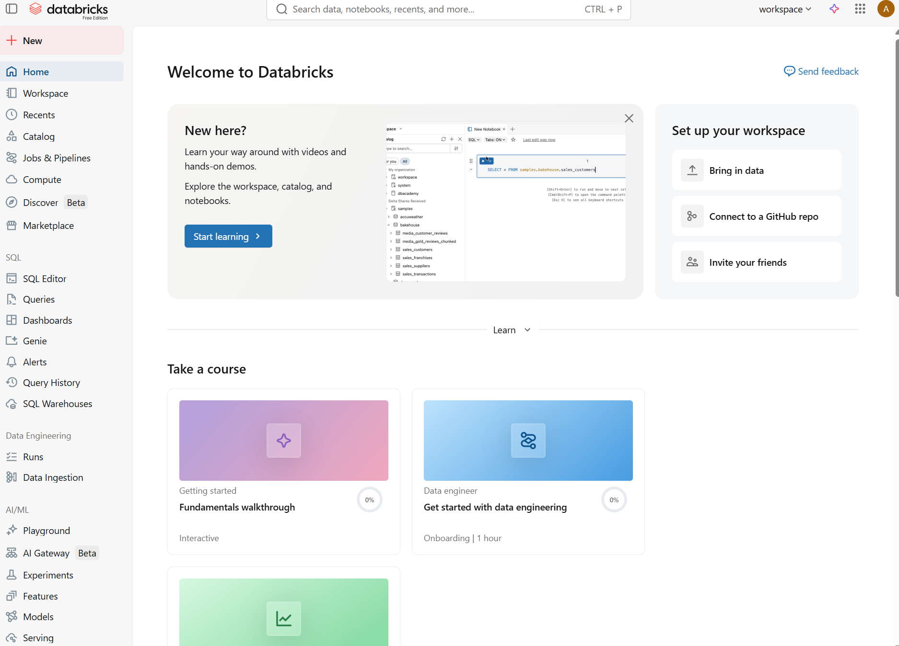

# 2. Primeiros pasos en Databricks

## 2.1 Creación dunha conta


Para comezar a traballar con Databricks é necesario dispoñer dunha conta na plataforma.

Unha das opcións máis sinxelas para uso educativo é a [**Databricks Free Edition**](https://www.databricks.com/learn/free-edition), que permite acceder a un contorno gratuíto con funcionalidades básicas.

Os pasos para crear unha conta son os seguintes:

1. Acceder á páxina oficial de [**Databricks Free Edition**](https://www.databricks.com/learn/free-edition).
2. Seleccionar **Sign up for Free Edition**.
3. Seleccionar **Google**, **Microsoft** ou introducir Email.
4. Revisar o correo e introducir o código de verificación.
5. Seleccionar nome e localización (normalmente deixar por defecto).

Unha vez completado este proceso, pódese acceder ao contorno de traballo de Databricks desde o navegador.
---

## 2.2 Acceso ao workspace

O **workspace** é o contorno principal no que se desenvolven todas as tarefas en Databricks.


Ao iniciar sesión, accédese directamente a este espazo, onde se poden:

- crear e organizar notebooks  
- xestionar datos  
- lanzar procesos de computación  
- definir workflows  

O workspace funciona como punto central para o desenvolvemento e execución de pipelines de datos.

---

## 2.3 Interface de Databricks

A interface de Databricks está organizada en diferentes áreas que permiten acceder ás distintas funcionalidades da plataforma.




### Barra lateral

A barra lateral permite navegar polas principais seccións do sistema:

- **Workspace**: acceso a notebooks, ficheiros e cartafoles  
- **Catalog**: exploración e xestión de datos (catálogos, esquemas e táboas)  
- **Compute**: xestión de clusters de procesamento  
- **Workflows / Jobs**: definición e execución de tarefas automatizadas  
- **SQL**: acceso a consultas SQL e análise de datos  

Dependendo da versión da plataforma, poden aparecer outras opcións adicionais, pero estas son as principais para o traballo con pipelines de datos.

---

### Zona de traballo

A zona central da interface mostra o contido seleccionado:

- notebooks  
- resultados de execución  
- ficheiros  

Neste espazo é onde se desenvolve a maior parte do traballo co código e os datos.

---

### Barra superior

Na parte superior da interface aparece unha barra global que permite acceder a diferentes funcionalidades da plataforma:

- **buscador**: permite localizar notebooks, datos e outros recursos  
- **selector de workspace**: permite cambiar entre distintos contornos de traballo  
- **acceso a Lakehouse / Databricks One**: entrada a diferentes vistas da plataforma  
- **configuración da conta**: xestión do perfil e preferencias do usuario  

Esta barra está presente en todo momento e facilita a navegación xeral dentro da plataforma.

---

### Barra de execución en notebooks

Cando se abre un notebook, aparece unha barra específica para a execución de código.

Nesta barra pódense realizar accións como:

- seleccionar o cluster de execución  
- executar celas de código  
- controlar o estado da execución  

Esta barra está asociada ao traballo interactivo cos notebooks.

---

## 2.4 Primeiro contacto coa plataforma

Unha vez dentro do workspace, pódense realizar as primeiras accións básicas:

- crear un novo notebook  
- seleccionar unha linguaxe (Python ou SQL, por exemplo)  
- conectar o notebook a un cluster  
- executar unha primeira cela de código  

Este primeiro contacto permite familiarizarse coa contorna e comprobar o funcionamento básico da plataforma.

A partir deste punto, pódese comezar a traballar con datos e desenvolver pipelines máis complexos.

---

## 2.5. Primeiro notebook en Databricks

Neste primeiro exemplo crearase un conxunto de datos sinxelo e realizaranse operacións básicas con Spark.

---

### 1. Crear un DataFrame

```python
data = [
    ("Ana", 23),
    ("Luis", 35),
    ("Marta", 29),
    ("Pedro", 41)
]

columns = ["nome", "idade"]

df = spark.createDataFrame(data, columns)
df.show()
```

---

### 2. Filtrar datos

```python
df_filtrado = df.filter(df.idade > 30)
df_filtrado.show()
```

---

### 3. Agrupar datos

```python
from pyspark.sql.functions import avg

df.groupBy().agg(avg("idade")).show()
```

---

### 4. Visualización básica

```python
display(df)
```

Databricks permite visualizar os datos de forma interactiva, xerando gráficos simples a partir dos resultados.

---

### 5. Crear unha vista SQL

```python
df.createOrReplaceTempView("persoas")
```

```sql
SELECT nome, idade
FROM persoas
WHERE idade > 25
```

## Recursos adicionais

Para ampliar información sobre o uso de Databricks, pódese consultar a documentación oficial:

- https://www.databricks.com/databricks-documentation