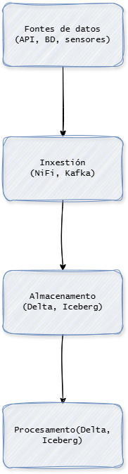
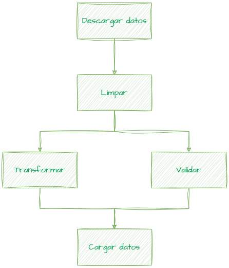
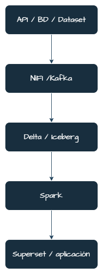

# Bloque 1. Introdución aos pipelines de datos

## 1. Recapitulación das capas dunha arquitectura de datos

Nas unidades anteriores estudáronse varias capas fundamentais dunha arquitectura de Big Data:

- **inxestión de datos**, que permite capturar información desde distintas fontes
- **almacenamento distribuído**, que permite gardar grandes volumes de datos de forma escalable
- **procesamento distribuído**, que permite transformar e analizar os datos mediante ferramentas como Apache Spark




Estas capas permiten construír sistemas capaces de traballar con grandes volumes de información. Con todo, nun contorno real estes procesos non se executan de maneira illada.

Os sistemas de datos adoitan estar formados por **varias tarefas encadeadas**, nas que cada etapa depende do resultado da anterior. Isto fai necesario organizar os procesos de forma estruturada.

Por exemplo:

```
obtención de datos → limpeza → transformación → almacenamento final → análise
```

Para organizar e automatizar este tipo de fluxos utilízanse os **pipelines de datos**.

---

## 2. Que é un pipeline de datos

Un **pipeline de datos** é un conxunto de procesos que permiten mover, transformar e preparar datos desde as súas fontes ata os sistemas onde se van utilizar.


Nun pipeline, os datos percorren distintas etapas que realizan tarefas específicas dentro dunha arquitectura de datos.

Un esquema simplificado sería:

```
fontes de datos
      ↓
inxestión
      ↓
almacenamento
      ↓
procesamento
      ↓
capa de consumo
```

As fontes de datos poden ser moi diversas:

- APIs
- bases de datos
- sensores e dispositivos IoT
- logs de aplicacións
- ficheiros
- fluxos de eventos

O pipeline encárgase de transportar os datos entre sistemas, aplicar transformacións e preparar a información para o seu uso final.

---

## 3. Pipelines e workflows

Nun sistema de datos non adoita executarse un único proceso, senón **varias tarefas relacionadas entre si**.

Un **workflow** é un conxunto de tarefas coordinadas que deben executarse nunha determinada orde.

Un **pipeline de datos** pode entenderse como un tipo de workflow orientado especificamente ao movemento e transformación de datos.

Por exemplo:

```
descargar datos
      ↓
limpar datos
      ↓
transformar datos
      ↓
cargar resultados
```

Cada tarefa só pode executarse cando a anterior rematou correctamente.

---

## 4. Problemas que resolven os pipelines de datos

Nun sistema sinxelo poderían empregarse scripts illados para procesar información. Con todo, en contornos reais aparecen varios problemas que fan necesario organizar os procesos mediante pipelines.

### Automatización

Moitos procesos deben executarse de maneira periódica ou automática:

- cada hora
- cada día
- cando se actualizan os datos
- cando se produce un evento

Os pipelines permiten **automatizar estes fluxos de traballo**.

---

### Dependencias entre tarefas

Nun fluxo de datos é habitual que unha tarefa dependa do resultado doutra.

Un pipeline permite definir **dependencias entre tarefas**, garantindo que cada proceso se executa no momento adecuado.

---

### Escalabilidade

Os volumes de datos poden crecer rapidamente. Os pipelines permiten integrar sistemas distribuídos capaces de procesar grandes cantidades de información.

---

### Monitorización e control

Nun sistema de datos é importante poder responder preguntas como:

- cando se executou un proceso?
- canto tempo tardou?
- que tarefa fallou?
- que datos se procesaron?

Os pipelines permiten incorporar mecanismos de **seguimento e control das execucións**.

---

## 5. ETL e ELT

Moitos pipelines estrutúranse seguindo modelos clásicos de procesamento de datos.

### ETL (Extract, Transform, Load)

Neste modelo os datos extráense das fontes, transfórmanse e posteriormente cárganse no sistema final.

```
fonte → extracción → transformación → almacenamento
```

Este enfoque foi tradicional nos **data warehouses**.

---

### ELT (Extract, Load, Transform)

Neste modelo os datos extráense e almacénanse primeiro, e as transformacións realízanse posteriormente.

```
fonte → extracción → almacenamento → transformación
```

Este enfoque é habitual nas arquitecturas modernas baseadas en:

- data lakes
- lakehouses
- sistemas distribuídos

Neste tipo de arquitecturas, ferramentas de procesamento distribuído como **Apache Spark** permiten transformar os datos unha vez almacenados.

---

## 6. A necesidade de orquestración

Nun pipeline real poden existir moitas tarefas diferentes, por exemplo:

- descargar datos dunha API
- executar procesos de limpeza
- lanzar tarefas de procesamento en Spark
- actualizar táboas nun sistema de almacenamento
- preparar datos para análise ou visualización

Coordinar todas estas tarefas require definir:

- a orde de execución
- as dependencias entre tarefas
- a planificación das execucións
- a xestión de erros

Este proceso coñécese como **orquestración de pipelines de datos**.



Ferramentas como **Apache Airflow** permiten definir estes fluxos de traballo mediante estruturas chamadas **DAG (Directed Acyclic Graph)**, que representan as tarefas e as súas dependencias.

---

## 7. Exemplo simplificado de pipeline de datos

Un exemplo típico de pipeline nun sistema de análise de datos podería ser o seguinte:



Cada etapa cumpre unha función específica dentro da arquitectura de datos.

---

## 8. Cara a arquitecturas completas de datos

Nun sistema moderno de Big Data, os pipelines forman parte dunha arquitectura máis ampla que integra distintas capas tecnolóxicas:

| capa | función |
|---|---|
| inxestión | capturar datos das fontes |
| almacenamento | gardar datos de forma escalable |
| procesamento | transformar e preparar datos |
| orquestración | coordinar tarefas e execucións |
| explotación | analizar ou visualizar información |

Nas unidades anteriores traballouse principalmente nas tres primeiras capas. Nesta unidade introducirase unha nova dimensión fundamental: **a creación, xestión e orquestración de pipelines de datos completos**.

Nos seguintes bloques analizaranse distintos enfoques para implementar estes pipelines, desde plataformas integradas que ofrecen todas estas capacidades nun único sistema ata arquitecturas modulares baseadas en ferramentas especializadas.
